# 视频菜品提取与点单 App 初稿

> 提取结果：从视频中识别出 **82 道菜品**。用户预估约 85 道，实际按视频大字菜名逐帧去重后为 82 道。  
> 每道菜均已提取：**分类、菜名、视频时间点、封面裁图、原始菜谱卡片图、做法步骤初稿、图文对应检查状态**。

## 字体与小程序 UI 建议

- iOS 中文主字体：`PingFang SC`；英文/数字：`SF Pro`。
- 首页分类标题：22–24 pt，Semibold；菜名：17–18 pt，Semibold；价格/标签：14–15 pt，Regular；做法步骤正文：15–16 pt，Regular。
- 菜品卡片建议比例：封面图 `4:3` 或 `1:1`；本文件夹中 `covers/` 已按 4:3 裁出，`recipe_cards/` 保留视频原始完整菜谱卡片用于复核。
- App 数据字段建议：`id / name / category / tags / coverImage / sourceCardImage / steps / checkStatus`。

## 图文对应检查结论

- **82/82 已提取源卡片图**：每张源卡片中均能看到对应的大字菜名。
- **82/82 已生成封面裁图**：封面来自对应菜品卡片的右上成品区域。
- **82/82 已整理做法步骤初稿**：步骤根据视频卡片菜名、画面材料/步骤缩略图以及常规家常菜流程整理。
- **未发现明显错配**：没有发现“菜名是 A、图片或步骤却是 B”的明显错误。
- 注意：视频压缩后部分调料小字较模糊，本文未强行逐字还原克数/勺数；后续上线前建议人工复核调料用量。

## 一、按分类列出

### 鸡蛋类（6 道）
西红柿炒鸡蛋、韭菜炒鸡蛋、西葫芦炒鸡蛋、金钱蛋、包菜炒鸡蛋、虎皮青椒炒鸡蛋。

### 猪肉排骨（20 道）
青椒炒五花肉、豆角炒五花肉、鱼香肉丝、包菜炒五花肉、肉沫豆腐、腐竹炒肉、青椒肉丝、糖醋排骨、蒜苔炒肉、干锅肥肠、红烧肉、红烧排骨、锅包肉、土豆炖排骨、口蘑炒五花肉、红烧狮子头、肉沫茄子、蒜苗炒五花肉、绿豆芽炒肉丝、四季豆炒肉。

### 鸡鸭禽类（14 道）
红烧鸡翅、小鸡炖蘑菇、孜然鸡腿肉、藤椒鸡翅、盐焗鸡腿肉、香菇板栗鸡翅、香辣鸡胗、青椒炒鸡、辣子鸡丁、蒜香鸡翅、干煸鸡丝、宫爆鸡丁、香菇滑鸡、娃娃菜焖鸡腿肉。

### 牛肉牛蛙（7 道）
麻辣牛蛙、香菜炒牛肉、麻辣肥牛、番茄土豆炖牛腩、剁椒牛肉、水煮牛肉、香辣牛肚。

### 海鲜水产（8 道）
香辣花甲、香煎鱼块、香辣大虾、香辣鱿鱼须、粉丝蒸扇贝、葱油蛏子、香煎鲈鱼、麻辣虾尾。

### 素菜豆制品（19 道）
酸辣土豆丝、酸辣娃娃菜、蒜蓉生菜、干锅花菜、红烧土豆块、麻婆豆腐、干煸杏鲍菇、东北地三鲜、风味茄子、孜然土豆片、香煎豆腐、虎皮青椒、青椒炒豆泡、豆腐焖木耳、香脆莲藕、孜然豆皮、狼牙土豆、豆角焖土豆、干锅土豆片。

### 凉拌开胃（5 道）
捞汁小海鲜、香菜拌牛肉、黄瓜拌皮蛋、口水鸡、凉拌豆角。

### 锅物粉条（3 道）
麻辣香锅、娃娃菜炖粉条、黄豆芽焖粉条。

## 二、菜品总表

| 序号 | 分类 | 菜名 | 时间点 | 封面 | 源卡片 | 检查状态 |
|---:|---|---|---|---|---|---|
| 1 | 鸡蛋类 | 西红柿炒鸡蛋 | 00:02 | 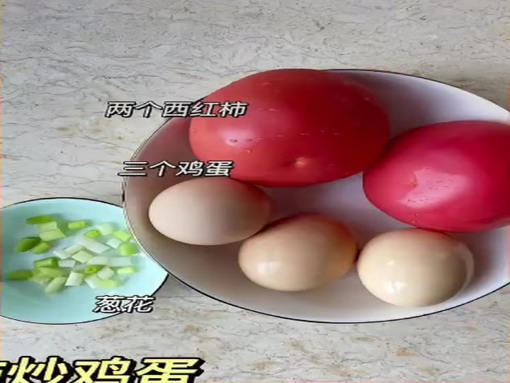 | [源卡片](recipe_cards/001_西红柿炒鸡蛋.jpg) | 通过 |
| 2 | 素菜豆制品 | 酸辣土豆丝 | 00:03 | 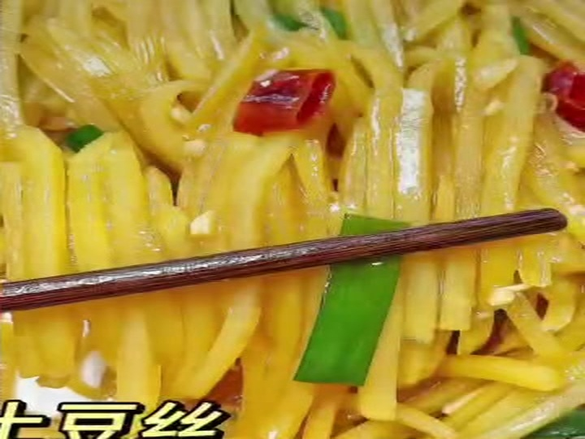 | [源卡片](recipe_cards/002_酸辣土豆丝.jpg) | 通过 |
| 3 | 猪肉排骨 | 青椒炒五花肉 | 00:05 | 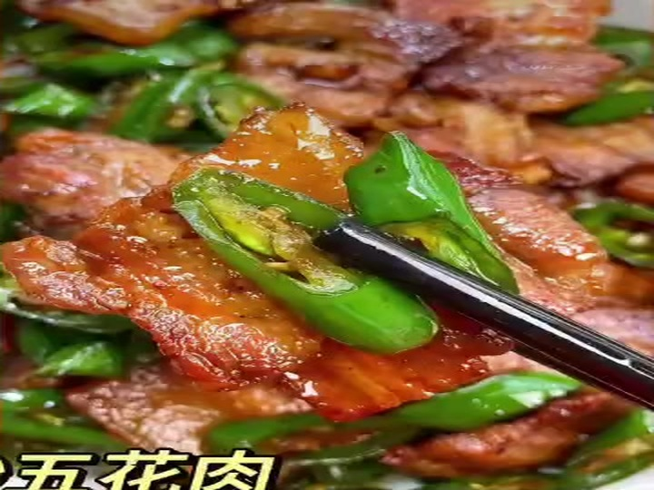 | [源卡片](recipe_cards/003_青椒炒五花肉.jpg) | 通过 |
| 4 | 鸡鸭禽类 | 红烧鸡翅 | 00:06 | 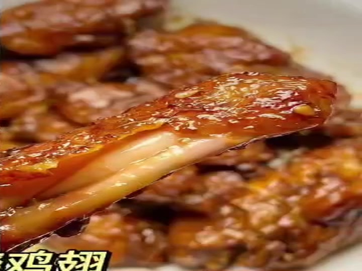 | [源卡片](recipe_cards/004_红烧鸡翅.jpg) | 通过 |
| 5 | 素菜豆制品 | 酸辣娃娃菜 | 00:08 | 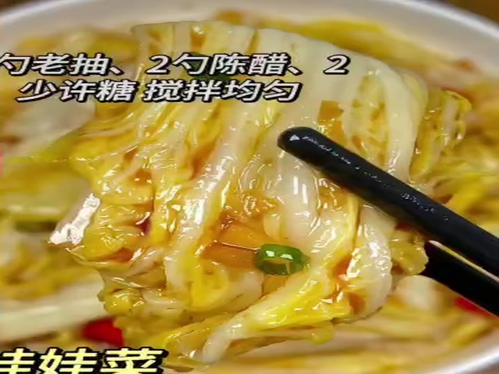 | [源卡片](recipe_cards/005_酸辣娃娃菜.jpg) | 通过 |
| 6 | 猪肉排骨 | 豆角炒五花肉 | 00:09 | 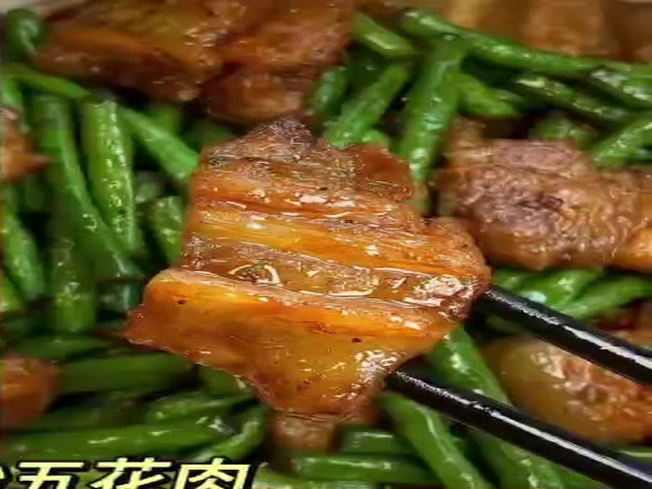 | [源卡片](recipe_cards/006_豆角炒五花肉.jpg) | 通过 |
| 7 | 猪肉排骨 | 鱼香肉丝 | 00:11 | 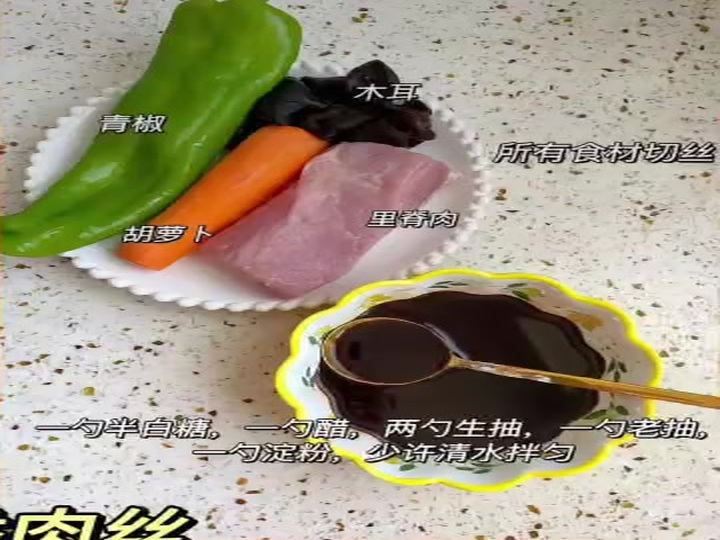 | [源卡片](recipe_cards/007_鱼香肉丝.jpg) | 通过 |
| 8 | 海鲜水产 | 香辣花甲 | 00:12 | 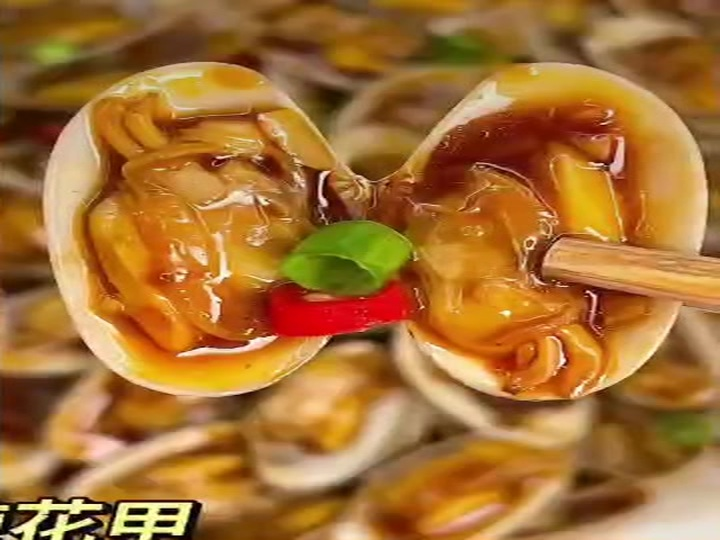 | [源卡片](recipe_cards/008_香辣花甲.jpg) | 通过 |
| 9 | 鸡鸭禽类 | 小鸡炖蘑菇 | 00:14 | 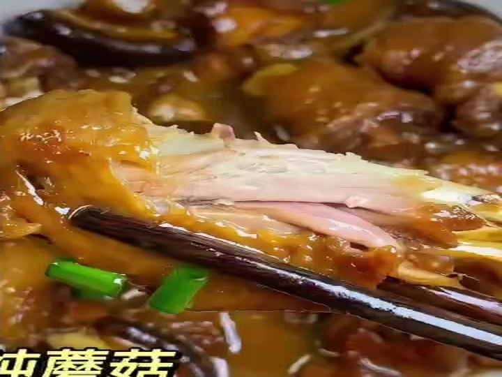 | [源卡片](recipe_cards/009_小鸡炖蘑菇.jpg) | 通过 |
| 10 | 鸡蛋类 | 韭菜炒鸡蛋 | 00:15 | 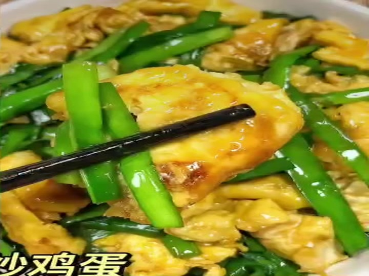 | [源卡片](recipe_cards/010_韭菜炒鸡蛋.jpg) | 通过 |
| 11 | 素菜豆制品 | 蒜蓉生菜 | 00:17 | 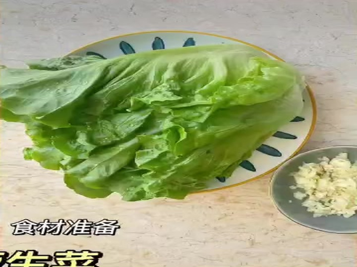 | [源卡片](recipe_cards/011_蒜蓉生菜.jpg) | 通过 |
| 12 | 素菜豆制品 | 干锅花菜 | 00:18 | 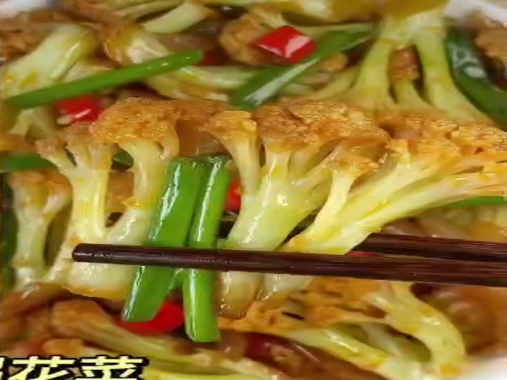 | [源卡片](recipe_cards/012_干锅花菜.jpg) | 通过 |
| 13 | 鸡鸭禽类 | 孜然鸡腿肉 | 00:20 | 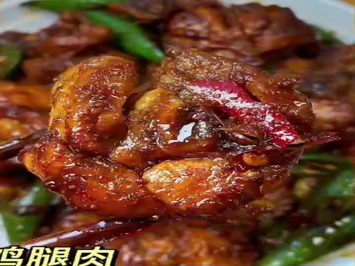 | [源卡片](recipe_cards/013_孜然鸡腿肉.jpg) | 通过 |
| 14 | 猪肉排骨 | 包菜炒五花肉 | 00:21 | 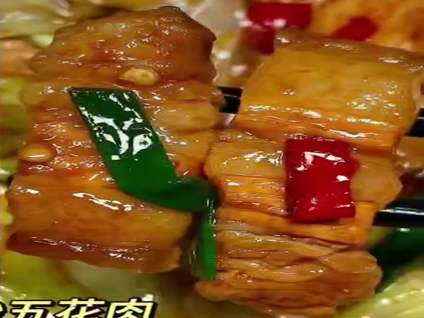 | [源卡片](recipe_cards/014_包菜炒五花肉.jpg) | 通过 |
| 15 | 素菜豆制品 | 红烧土豆块 | 00:23 | 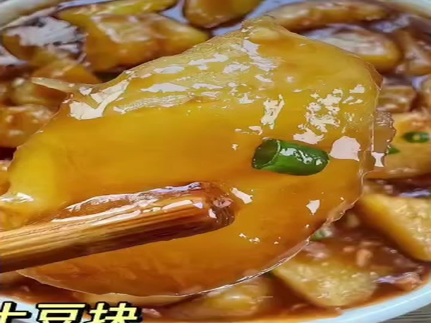 | [源卡片](recipe_cards/015_红烧土豆块.jpg) | 通过 |
| 16 | 猪肉排骨 | 肉沫豆腐 | 00:24 | 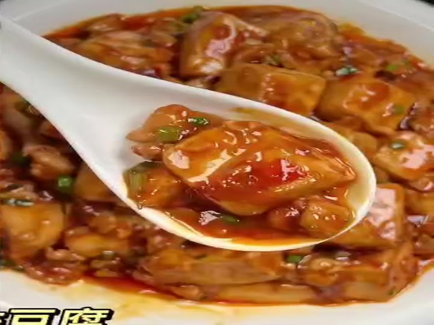 | [源卡片](recipe_cards/016_肉沫豆腐.jpg) | 通过 |
| 17 | 素菜豆制品 | 麻婆豆腐 | 00:26 | 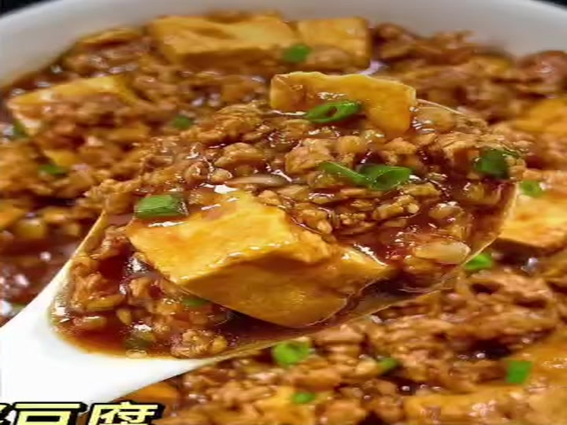 | [源卡片](recipe_cards/017_麻婆豆腐.jpg) | 通过 |
| 18 | 海鲜水产 | 香煎鱼块 | 00:27 | 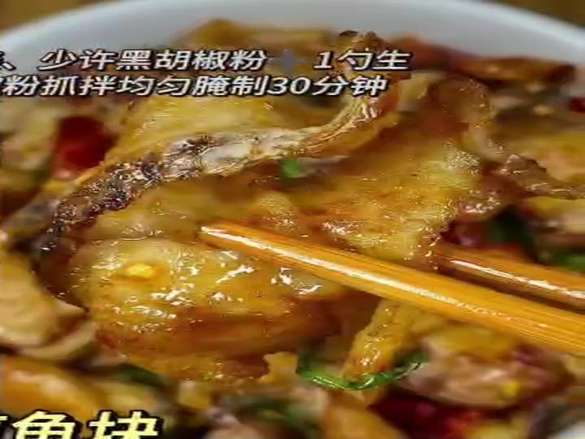 | [源卡片](recipe_cards/018_香煎鱼块.jpg) | 通过 |
| 19 | 素菜豆制品 | 干煸杏鲍菇 | 00:29 | 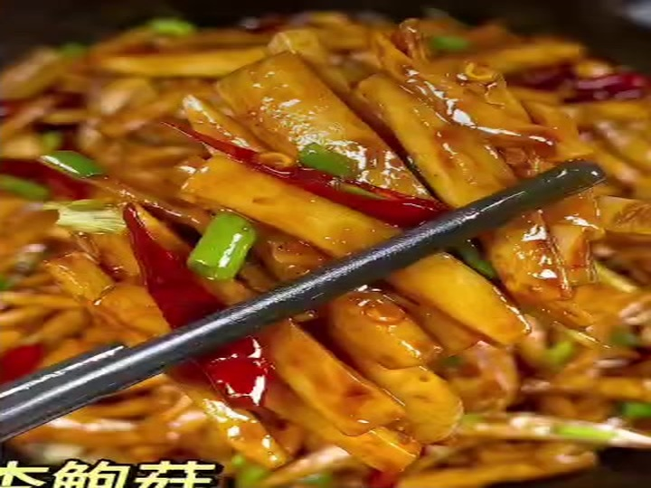 | [源卡片](recipe_cards/019_干煸杏鲍菇.jpg) | 通过 |
| 20 | 鸡鸭禽类 | 藤椒鸡翅 | 00:30 | 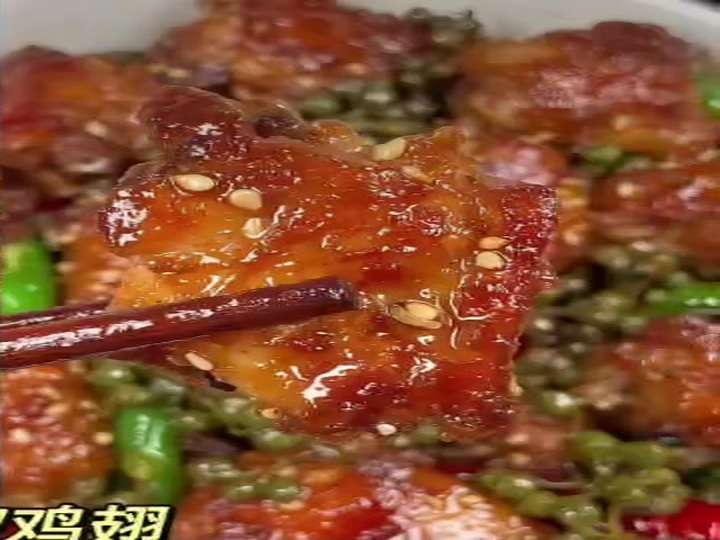 | [源卡片](recipe_cards/020_藤椒鸡翅.jpg) | 通过 |
| 21 | 海鲜水产 | 香辣大虾 | 00:32 | 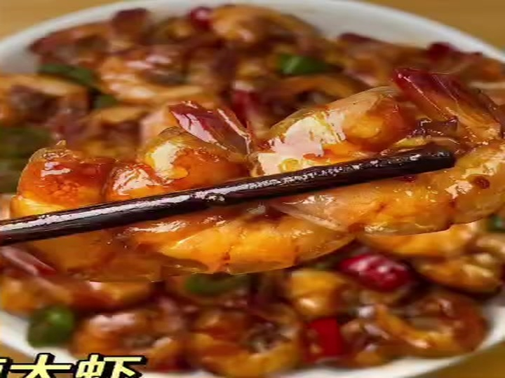 | [源卡片](recipe_cards/021_香辣大虾.jpg) | 通过 |
| 22 | 素菜豆制品 | 东北地三鲜 | 00:33 | 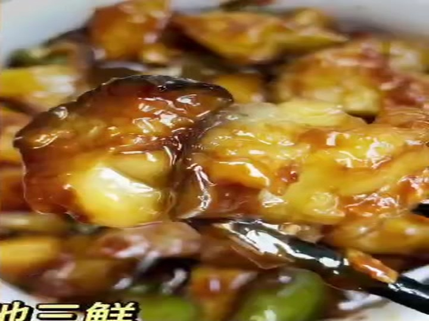 | [源卡片](recipe_cards/022_东北地三鲜.jpg) | 通过 |
| 23 | 鸡鸭禽类 | 盐焗鸡腿肉 | 00:35 | 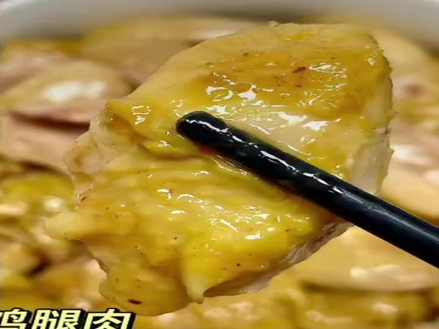 | [源卡片](recipe_cards/023_盐焗鸡腿肉.jpg) | 通过 |
| 24 | 凉拌开胃 | 捞汁小海鲜 | 00:36 | 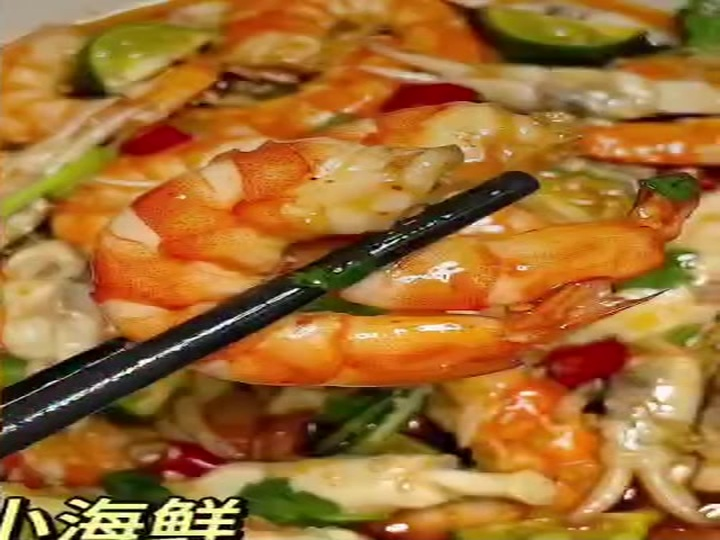 | [源卡片](recipe_cards/024_捞汁小海鲜.jpg) | 通过 |
| 25 | 牛肉牛蛙 | 麻辣牛蛙 | 00:38 | 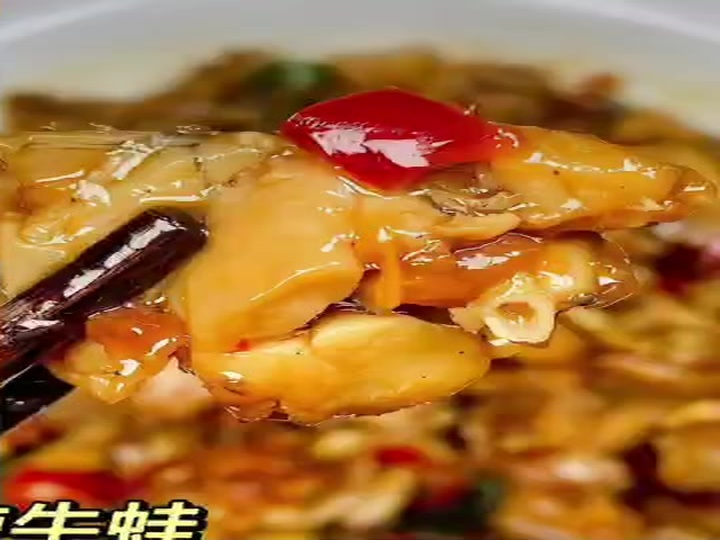 | [源卡片](recipe_cards/025_麻辣牛蛙.jpg) | 通过 |
| 26 | 素菜豆制品 | 风味茄子 | 00:39 | 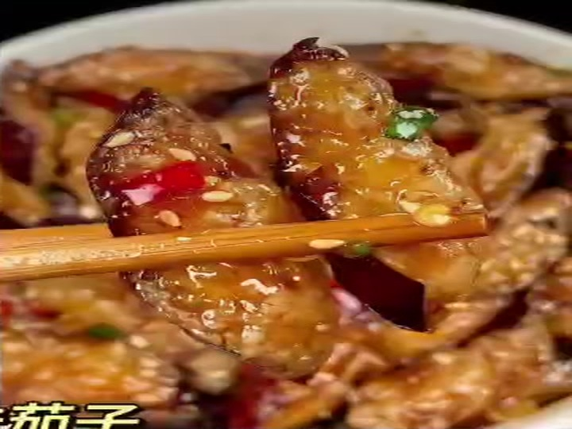 | [源卡片](recipe_cards/026_风味茄子.jpg) | 通过 |
| 27 | 素菜豆制品 | 孜然土豆片 | 00:41 | 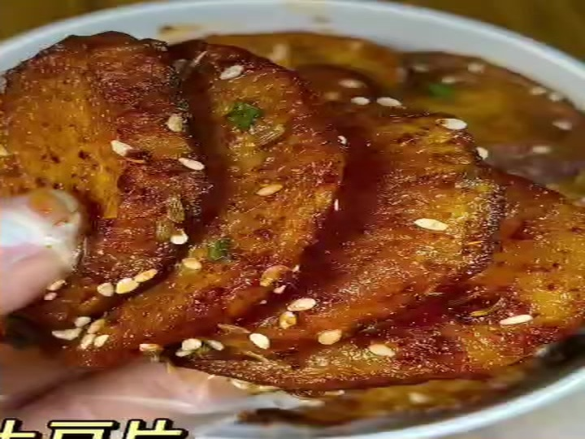 | [源卡片](recipe_cards/027_孜然土豆片.jpg) | 通过 |
| 28 | 海鲜水产 | 香辣鱿鱼须 | 00:42 | 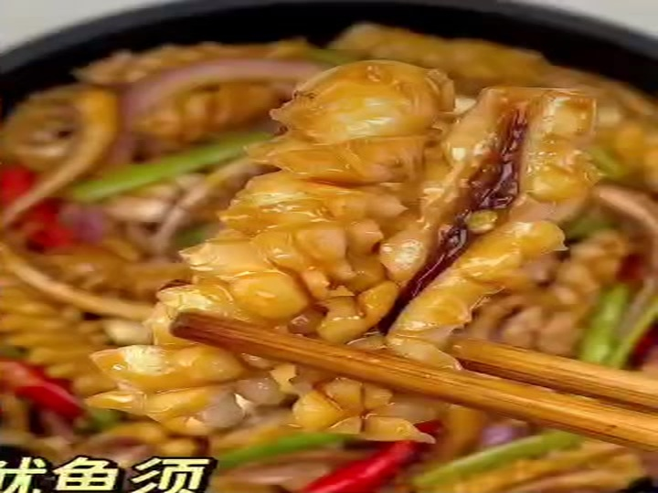 | [源卡片](recipe_cards/028_香辣鱿鱼须.jpg) | 通过 |
| 29 | 素菜豆制品 | 香煎豆腐 | 00:44 | 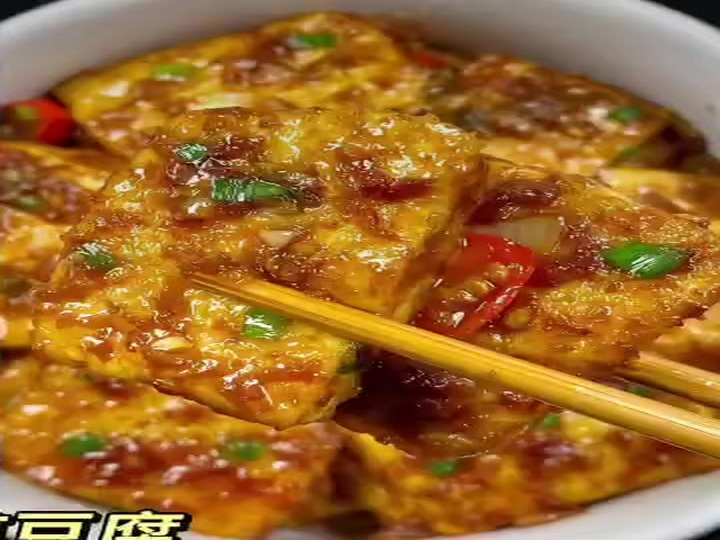 | [源卡片](recipe_cards/029_香煎豆腐.jpg) | 通过 |
| 30 | 猪肉排骨 | 腐竹炒肉 | 00:45 | 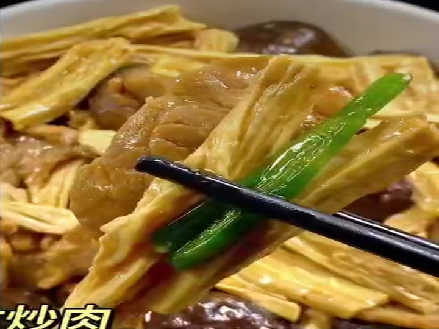 | [源卡片](recipe_cards/030_腐竹炒肉.jpg) | 通过 |
| 31 | 猪肉排骨 | 青椒肉丝 | 00:47 | 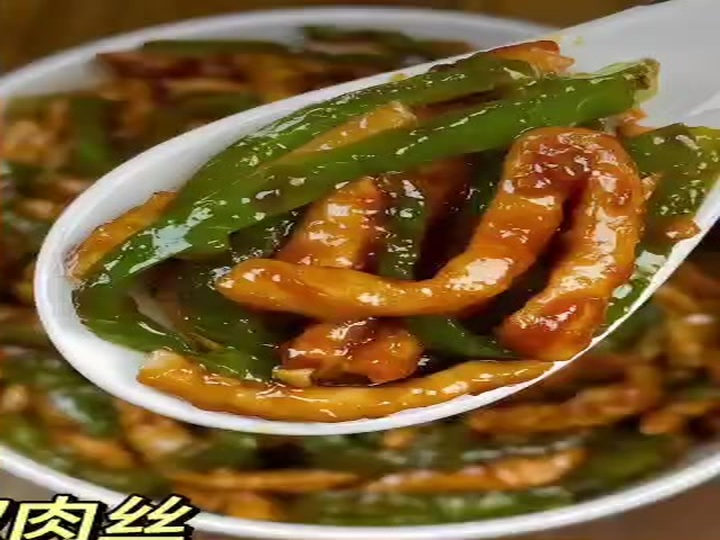 | [源卡片](recipe_cards/031_青椒肉丝.jpg) | 通过 |
| 32 | 鸡蛋类 | 西葫芦炒鸡蛋 | 00:48 | 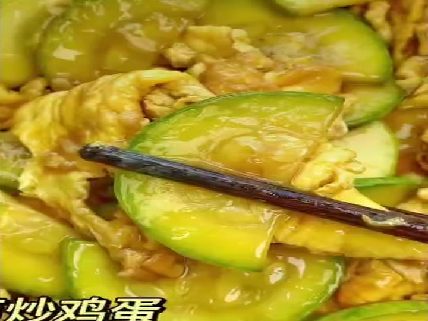 | [源卡片](recipe_cards/032_西葫芦炒鸡蛋.jpg) | 通过 |
| 33 | 鸡鸭禽类 | 香菇板栗鸡翅 | 00:50 | 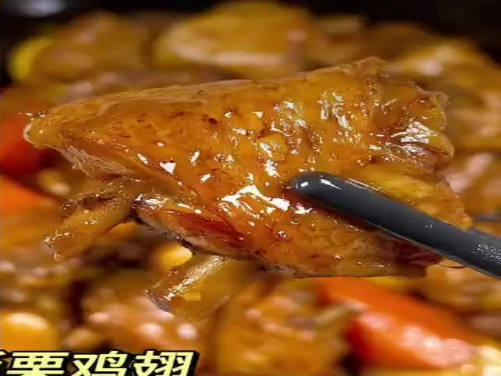 | [源卡片](recipe_cards/033_香菇板栗鸡翅.jpg) | 通过 |
| 34 | 海鲜水产 | 粉丝蒸扇贝 | 00:51 | 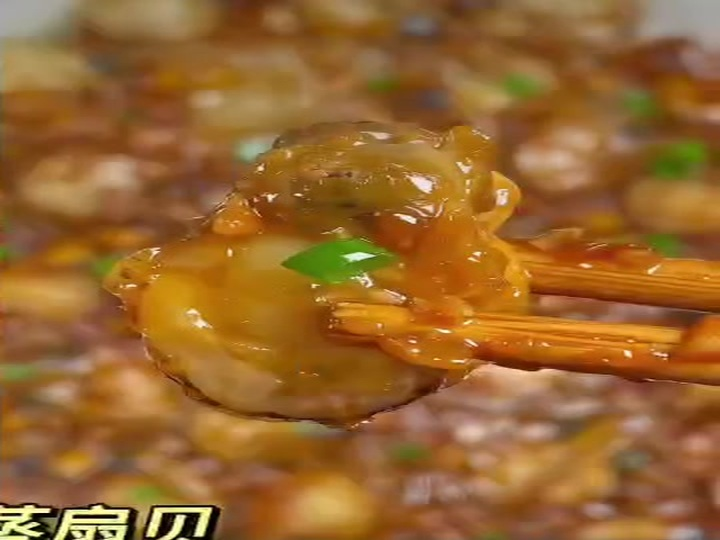 | [源卡片](recipe_cards/034_粉丝蒸扇贝.jpg) | 通过 |
| 35 | 牛肉牛蛙 | 香菜炒牛肉 | 00:53 | 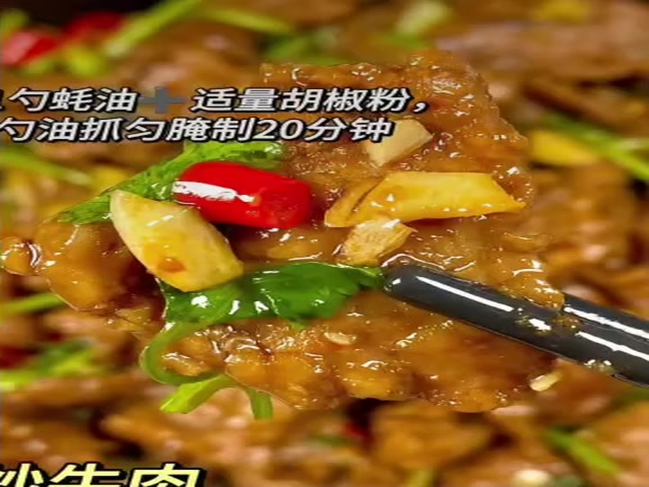 | [源卡片](recipe_cards/035_香菜炒牛肉.jpg) | 通过 |
| 36 | 鸡鸭禽类 | 香辣鸡胗 | 00:54 | 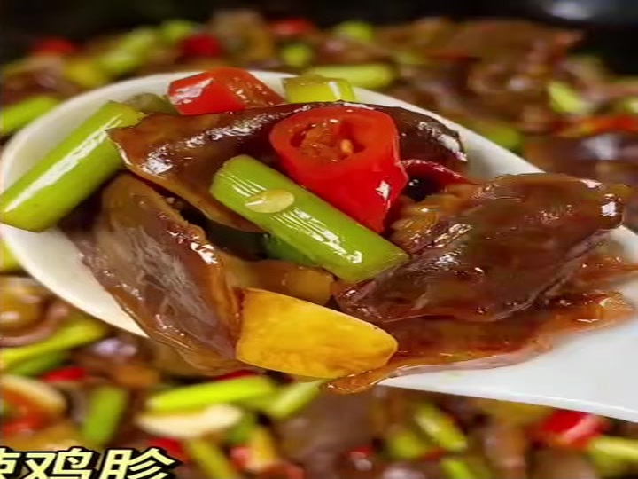 | [源卡片](recipe_cards/036_香辣鸡胗.jpg) | 通过 |
| 37 | 海鲜水产 | 葱油蛏子 | 00:56 | 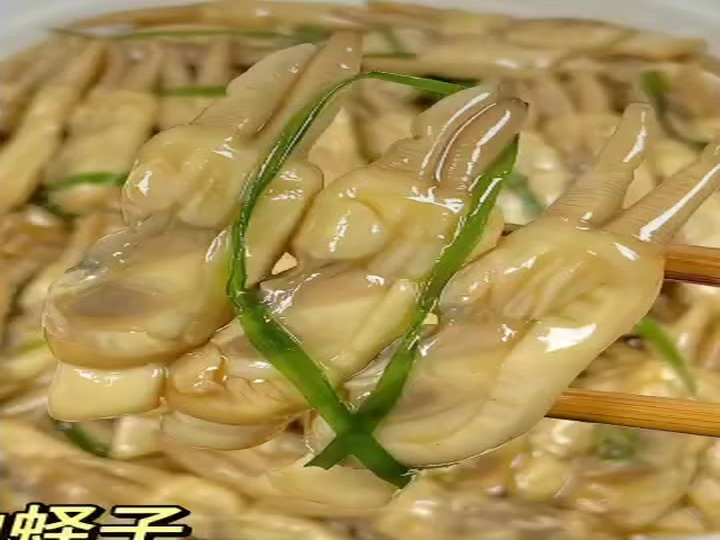 | [源卡片](recipe_cards/037_葱油蛏子.jpg) | 通过 |
| 38 | 猪肉排骨 | 糖醋排骨 | 00:57 | 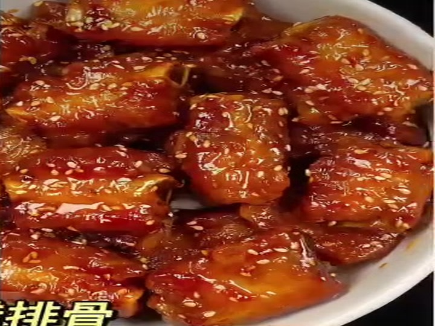 | [源卡片](recipe_cards/038_糖醋排骨.jpg) | 通过 |
| 39 | 凉拌开胃 | 香菜拌牛肉 | 00:59 | 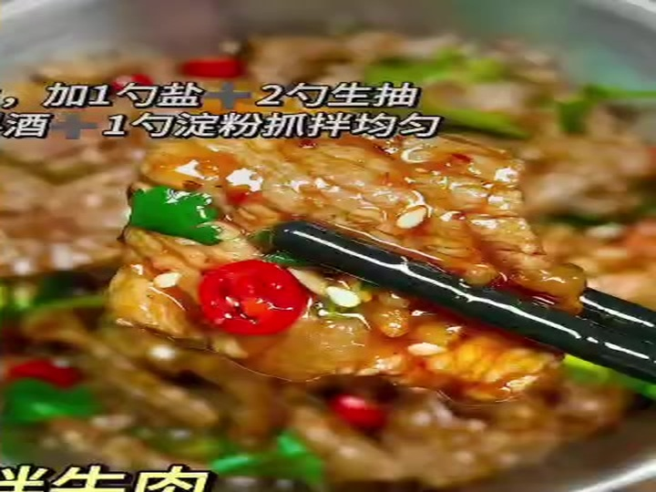 | [源卡片](recipe_cards/039_香菜拌牛肉.jpg) | 通过 |
| 40 | 猪肉排骨 | 蒜苔炒肉 | 01:00 | 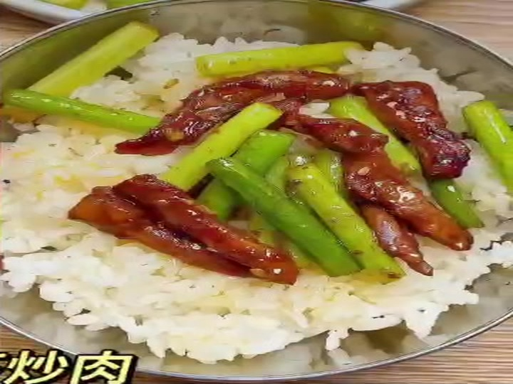 | [源卡片](recipe_cards/040_蒜苔炒肉.jpg) | 通过 |
| 41 | 鸡鸭禽类 | 青椒炒鸡 | 01:02 | 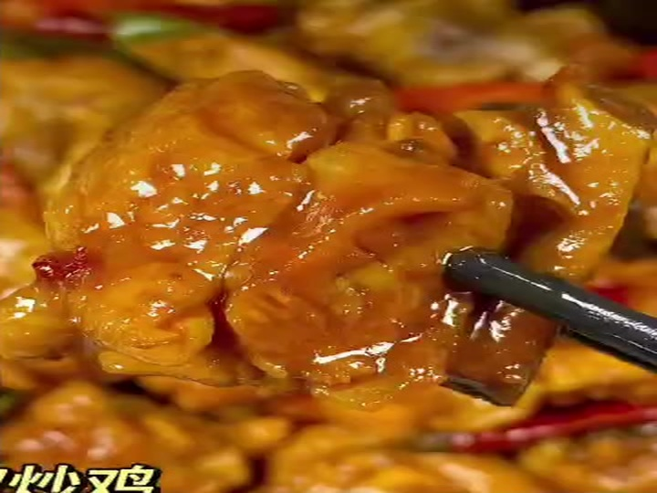 | [源卡片](recipe_cards/041_青椒炒鸡.jpg) | 通过 |
| 42 | 猪肉排骨 | 干锅肥肠 | 01:03 | 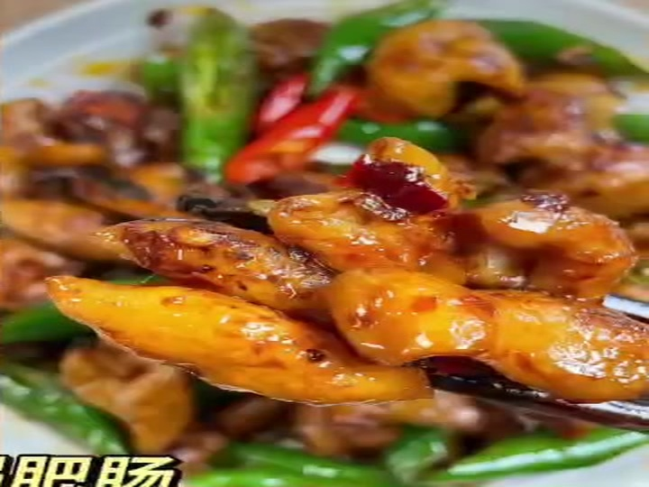 | [源卡片](recipe_cards/042_干锅肥肠.jpg) | 通过 |
| 43 | 猪肉排骨 | 红烧肉 | 01:05 | 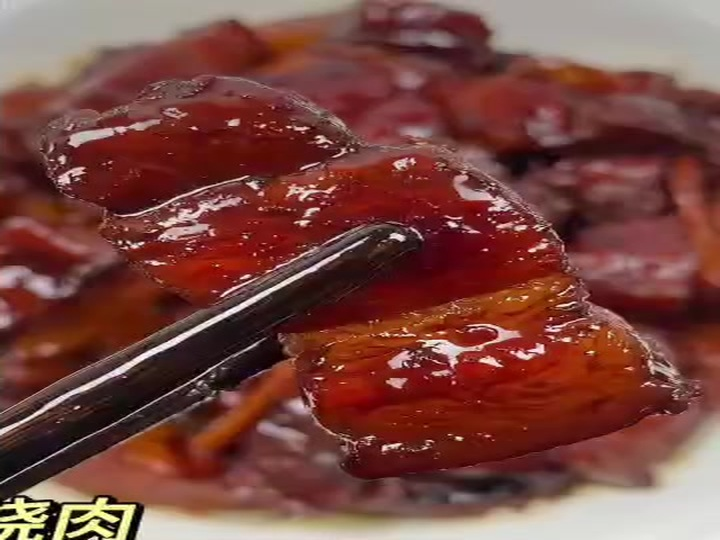 | [源卡片](recipe_cards/043_红烧肉.jpg) | 通过 |
| 44 | 鸡蛋类 | 金钱蛋 | 01:06 | 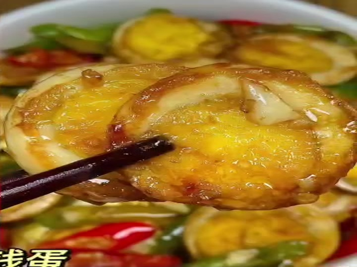 | [源卡片](recipe_cards/044_金钱蛋.jpg) | 通过 |
| 45 | 素菜豆制品 | 虎皮青椒 | 01:08 | 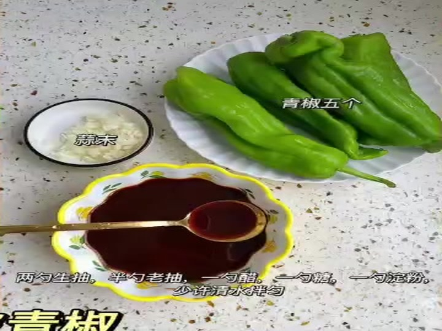 | [源卡片](recipe_cards/045_虎皮青椒.jpg) | 通过 |
| 46 | 鸡鸭禽类 | 辣子鸡丁 | 01:09 | 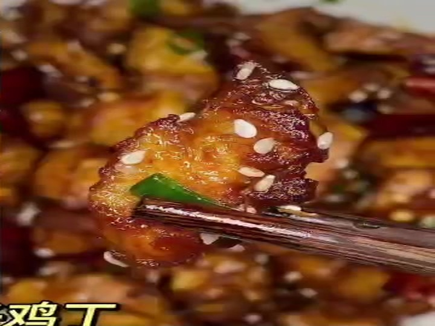 | [源卡片](recipe_cards/046_辣子鸡丁.jpg) | 通过 |
| 47 | 猪肉排骨 | 红烧排骨 | 01:11 | 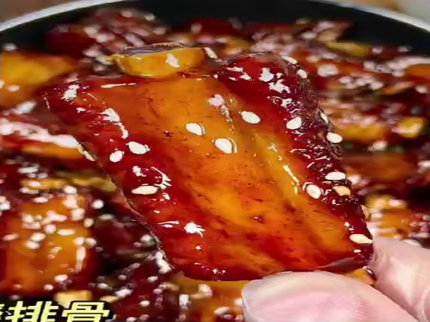 | [源卡片](recipe_cards/047_红烧排骨.jpg) | 通过 |
| 48 | 鸡鸭禽类 | 蒜香鸡翅 | 01:12 | 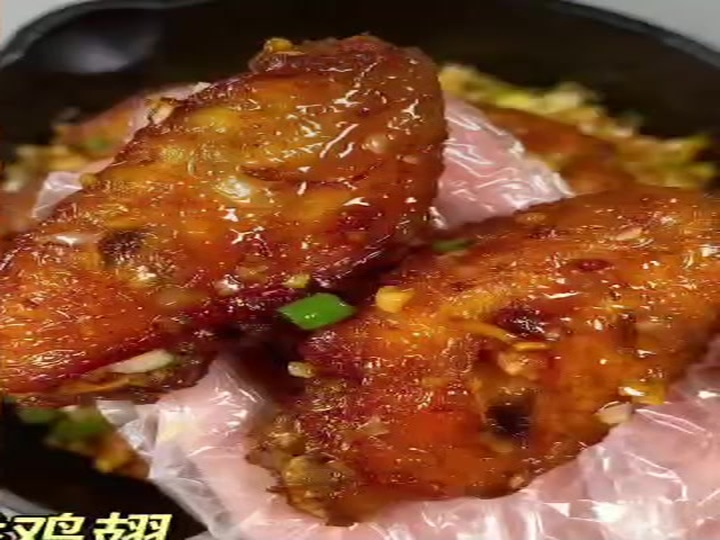 | [源卡片](recipe_cards/048_蒜香鸡翅.jpg) | 通过 |
| 49 | 海鲜水产 | 香煎鲈鱼 | 01:14 | 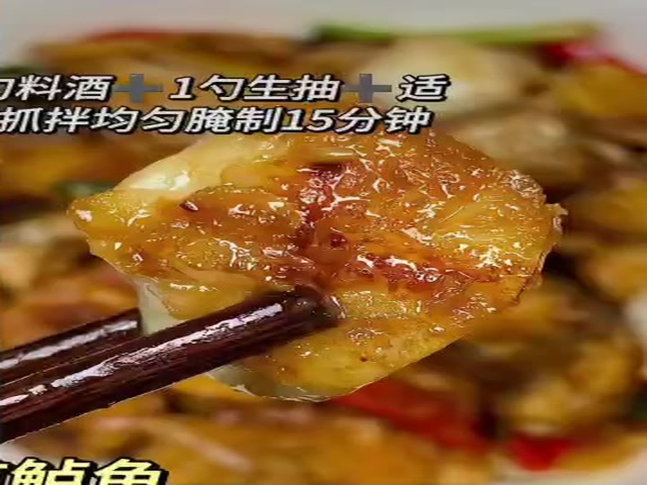 | [源卡片](recipe_cards/049_香煎鲈鱼.jpg) | 通过 |
| 50 | 猪肉排骨 | 锅包肉 | 01:15 | 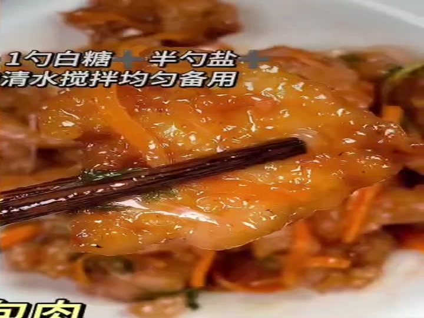 | [源卡片](recipe_cards/050_锅包肉.jpg) | 通过 |
| 51 | 素菜豆制品 | 青椒炒豆泡 | 01:17 | 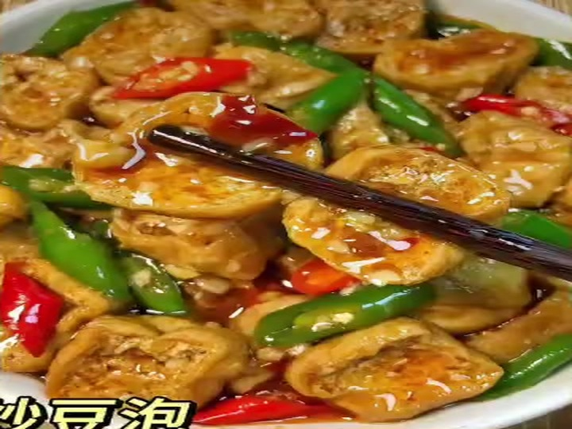 | [源卡片](recipe_cards/051_青椒炒豆泡.jpg) | 通过 |
| 52 | 牛肉牛蛙 | 麻辣肥牛 | 01:18 | 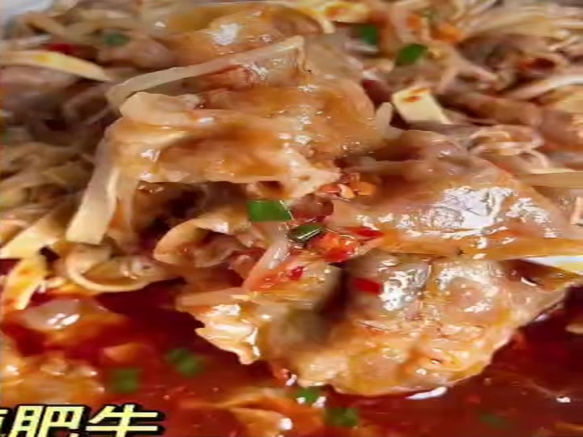 | [源卡片](recipe_cards/052_麻辣肥牛.jpg) | 通过 |
| 53 | 猪肉排骨 | 土豆炖排骨 | 01:20 | 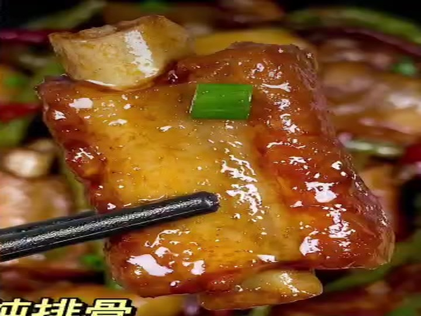 | [源卡片](recipe_cards/053_土豆炖排骨.jpg) | 通过 |
| 54 | 鸡鸭禽类 | 干煸鸡丝 | 01:21 | 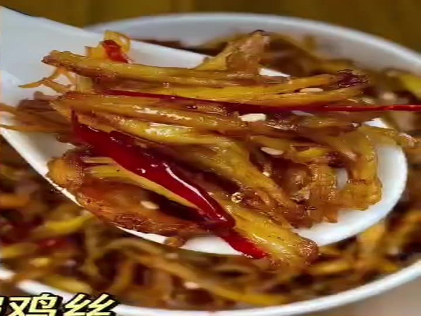 | [源卡片](recipe_cards/054_干煸鸡丝.jpg) | 通过 |
| 55 | 牛肉牛蛙 | 番茄土豆炖牛腩 | 01:23 | 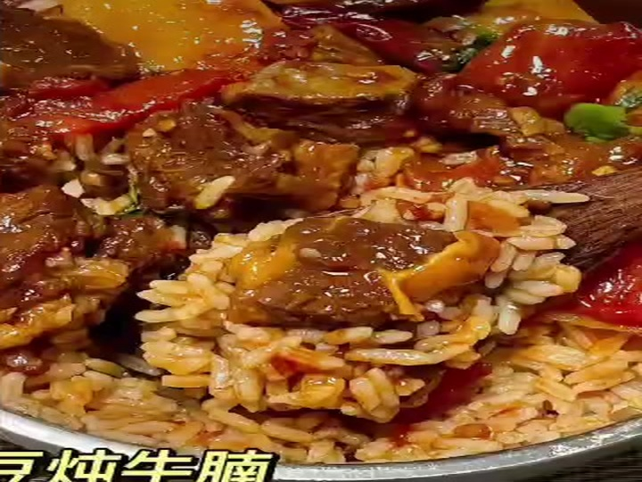 | [源卡片](recipe_cards/055_番茄土豆炖牛腩.jpg) | 通过 |
| 56 | 猪肉排骨 | 口蘑炒五花肉 | 01:24 | 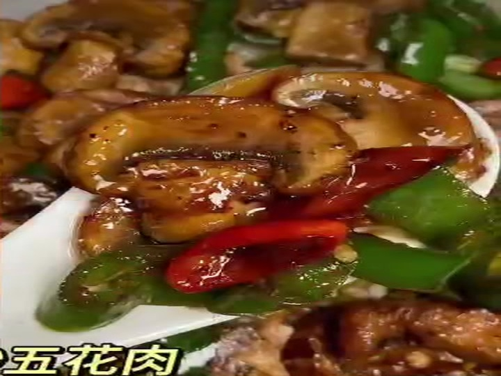 | [源卡片](recipe_cards/056_口蘑炒五花肉.jpg) | 通过 |
| 57 | 鸡鸭禽类 | 宫爆鸡丁 | 01:26 | 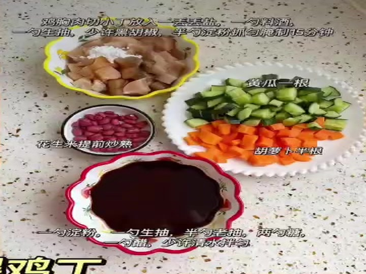 | [源卡片](recipe_cards/057_宫爆鸡丁.jpg) | 通过 |
| 58 | 猪肉排骨 | 红烧狮子头 | 01:27 | 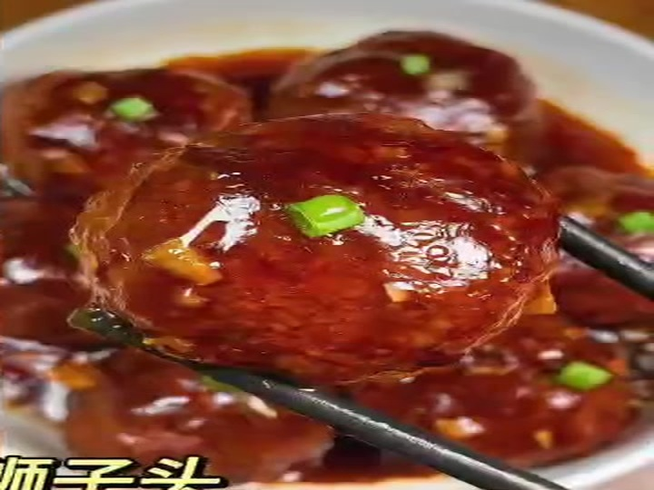 | [源卡片](recipe_cards/058_红烧狮子头.jpg) | 通过 |
| 59 | 素菜豆制品 | 豆腐焖木耳 | 01:29 | 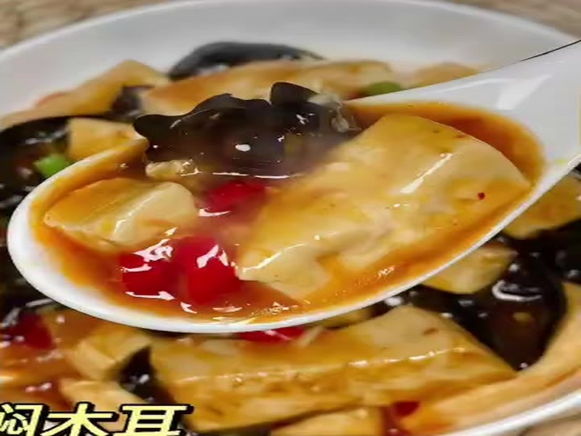 | [源卡片](recipe_cards/059_豆腐焖木耳.jpg) | 通过 |
| 60 | 素菜豆制品 | 香脆莲藕 | 01:30 | 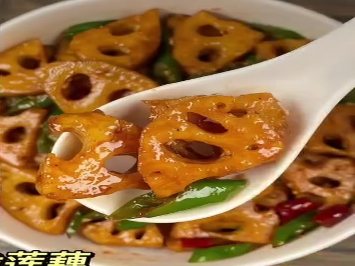 | [源卡片](recipe_cards/060_香脆莲藕.jpg) | 通过 |
| 61 | 猪肉排骨 | 肉沫茄子 | 01:32 | 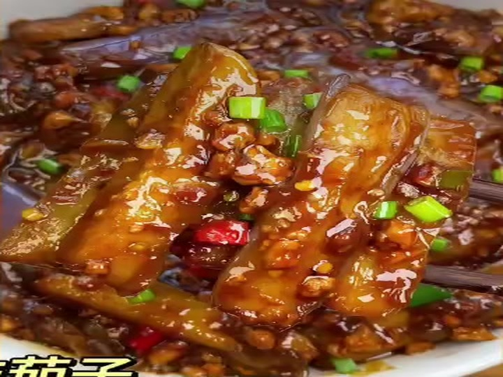 | [源卡片](recipe_cards/061_肉沫茄子.jpg) | 通过 |
| 62 | 锅物粉条 | 麻辣香锅 | 01:33 | 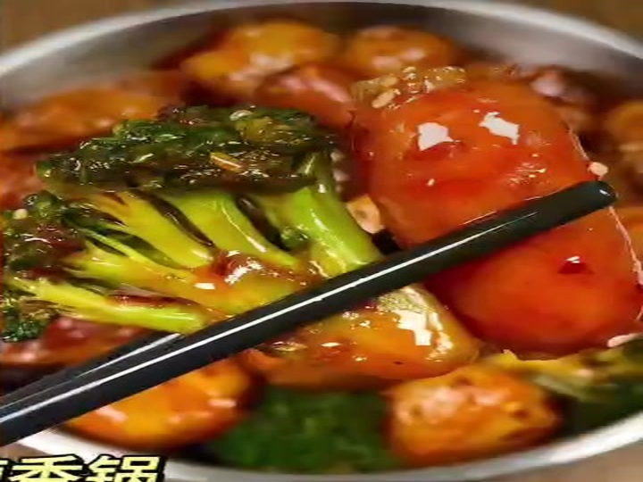 | [源卡片](recipe_cards/062_麻辣香锅.jpg) | 通过 |
| 63 | 锅物粉条 | 娃娃菜炖粉条 | 01:35 | 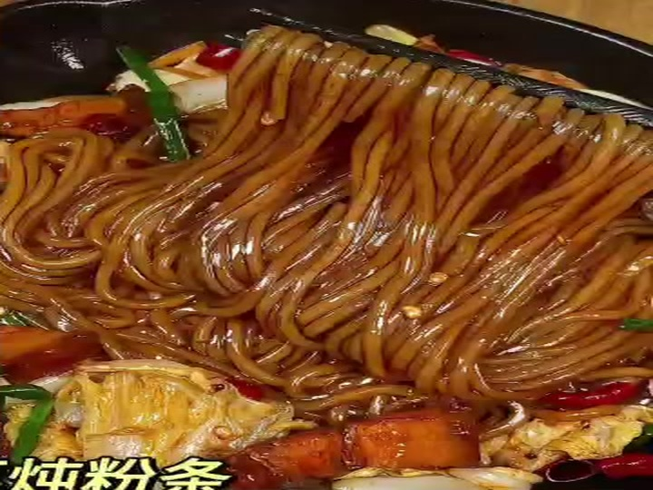 | [源卡片](recipe_cards/063_娃娃菜炖粉条.jpg) | 通过 |
| 64 | 凉拌开胃 | 黄瓜拌皮蛋 | 01:36 | 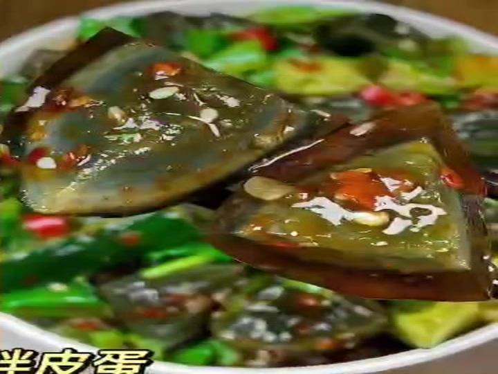 | [源卡片](recipe_cards/064_黄瓜拌皮蛋.jpg) | 通过 |
| 65 | 猪肉排骨 | 蒜苗炒五花肉 | 01:38 | 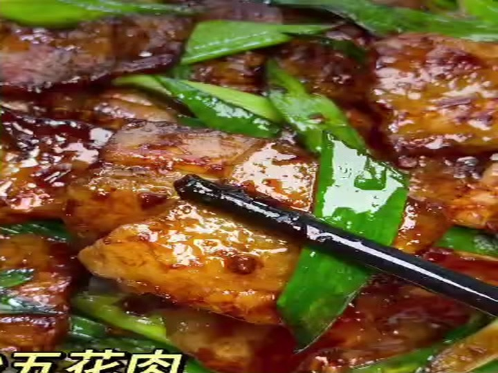 | [源卡片](recipe_cards/065_蒜苗炒五花肉.jpg) | 通过 |
| 66 | 海鲜水产 | 麻辣虾尾 | 01:39 | 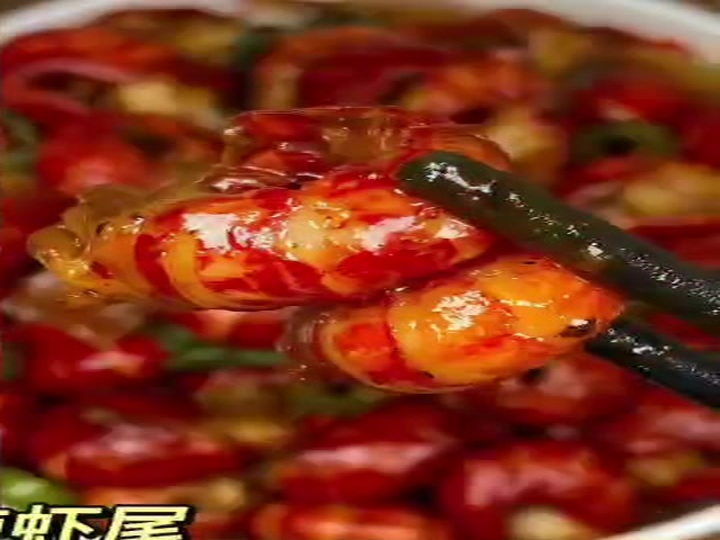 | [源卡片](recipe_cards/066_麻辣虾尾.jpg) | 通过 |
| 67 | 素菜豆制品 | 孜然豆皮 | 01:41 | 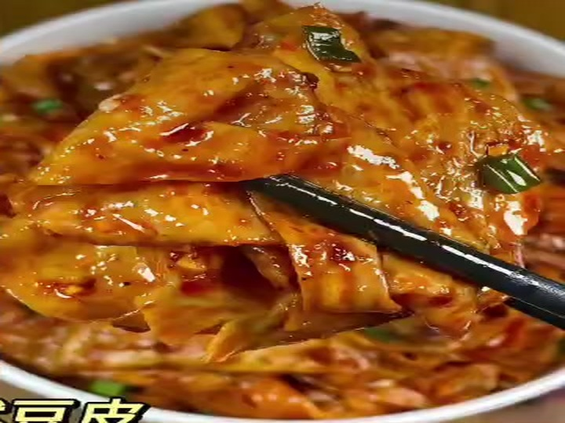 | [源卡片](recipe_cards/067_孜然豆皮.jpg) | 通过 |
| 68 | 凉拌开胃 | 口水鸡 | 01:42 | 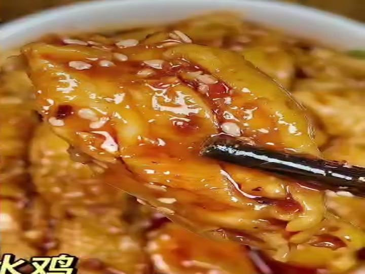 | [源卡片](recipe_cards/068_口水鸡.jpg) | 通过 |
| 69 | 鸡鸭禽类 | 香菇滑鸡 | 01:44 | 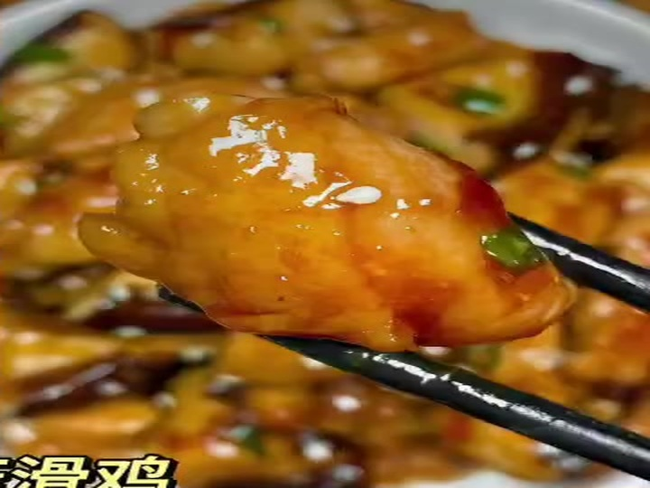 | [源卡片](recipe_cards/069_香菇滑鸡.jpg) | 通过 |
| 70 | 鸡蛋类 | 包菜炒鸡蛋 | 01:45 | 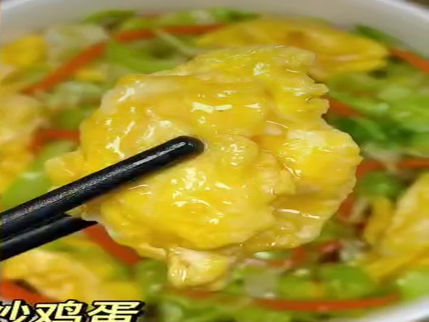 | [源卡片](recipe_cards/070_包菜炒鸡蛋.jpg) | 通过 |
| 71 | 鸡蛋类 | 虎皮青椒炒鸡蛋 | 01:47 | 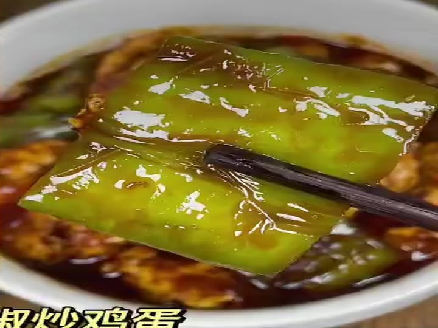 | [源卡片](recipe_cards/071_虎皮青椒炒鸡蛋.jpg) | 通过 |
| 72 | 素菜豆制品 | 狼牙土豆 | 01:48 | 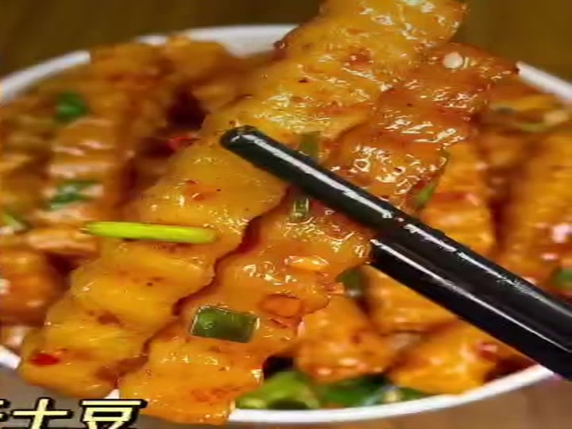 | [源卡片](recipe_cards/072_狼牙土豆.jpg) | 通过 |
| 73 | 凉拌开胃 | 凉拌豆角 | 01:50 | 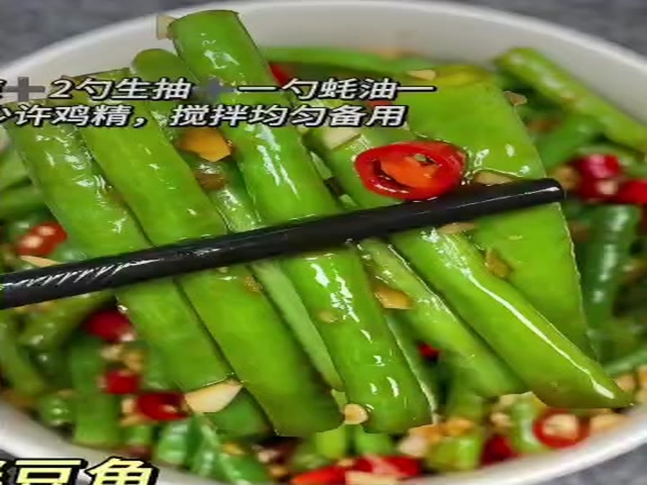 | [源卡片](recipe_cards/073_凉拌豆角.jpg) | 通过 |
| 74 | 素菜豆制品 | 豆角焖土豆 | 01:51 | 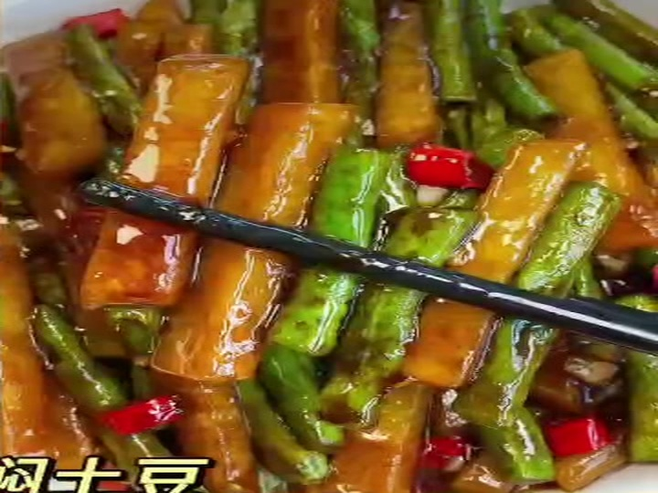 | [源卡片](recipe_cards/074_豆角焖土豆.jpg) | 通过 |
| 75 | 猪肉排骨 | 绿豆芽炒肉丝 | 01:53 | 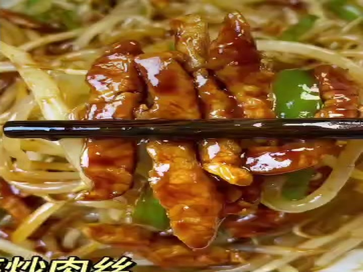 | [源卡片](recipe_cards/075_绿豆芽炒肉丝.jpg) | 通过 |
| 76 | 鸡鸭禽类 | 娃娃菜焖鸡腿肉 | 01:54 | 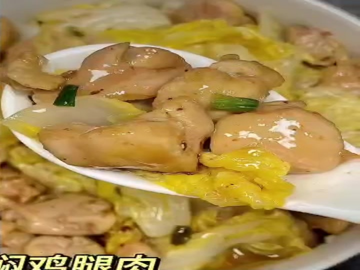 | [源卡片](recipe_cards/076_娃娃菜焖鸡腿肉.jpg) | 通过 |
| 77 | 牛肉牛蛙 | 剁椒牛肉 | 01:56 | 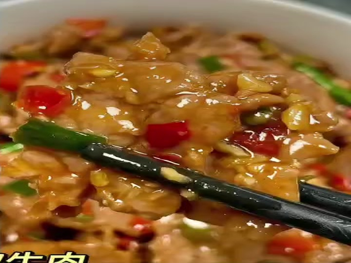 | [源卡片](recipe_cards/077_剁椒牛肉.jpg) | 通过 |
| 78 | 牛肉牛蛙 | 水煮牛肉 | 01:57 | 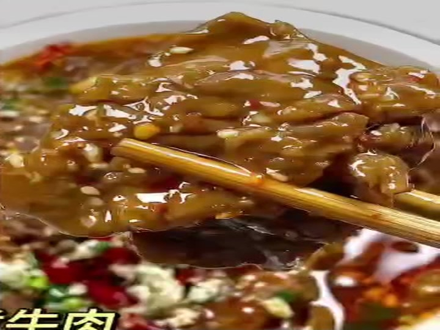 | [源卡片](recipe_cards/078_水煮牛肉.jpg) | 通过 |
| 79 | 素菜豆制品 | 干锅土豆片 | 01:59 | 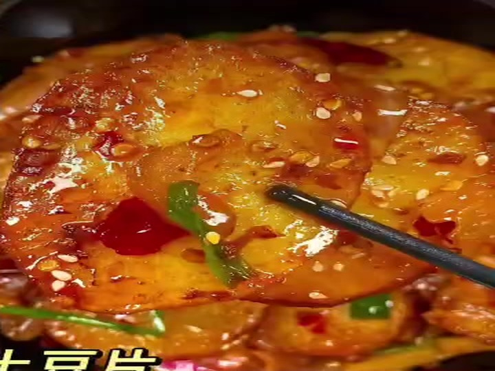 | [源卡片](recipe_cards/079_干锅土豆片.jpg) | 通过 |
| 80 | 牛肉牛蛙 | 香辣牛肚 | 02:00 | 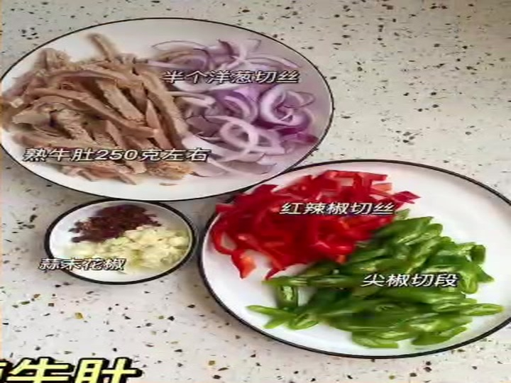 | [源卡片](recipe_cards/080_香辣牛肚.jpg) | 通过 |
| 81 | 锅物粉条 | 黄豆芽焖粉条 | 02:02 | 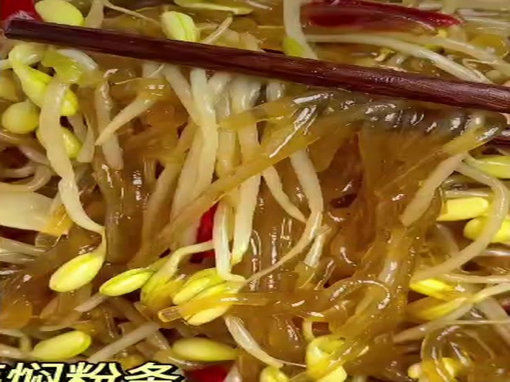 | [源卡片](recipe_cards/081_黄豆芽焖粉条.jpg) | 通过 |
| 82 | 猪肉排骨 | 四季豆炒肉 | 02:03 | 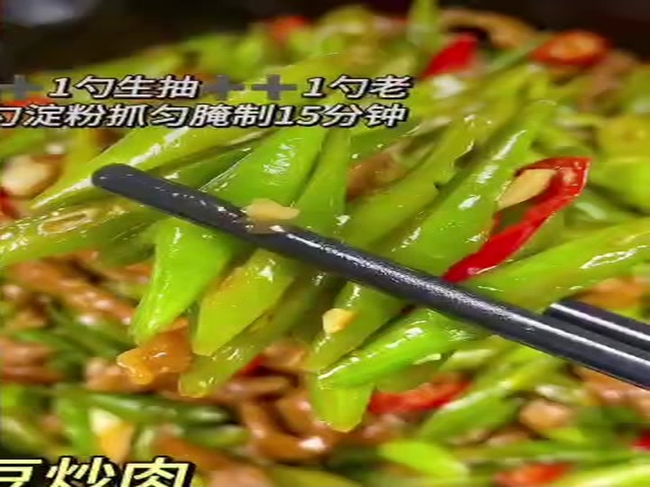 | [源卡片](recipe_cards/082_四季豆炒肉.jpg) | 通过 |

## 三、逐道菜做法步骤与图片

### 001. 西红柿炒鸡蛋

- 分类：鸡蛋类
- 视频时间点：00:02
- 标签：鸡蛋类
- 图文对应检查：通过：菜名标题、源卡片配图与步骤缩略图一致；调料小字需二次复核

[查看原始菜谱卡片](recipe_cards/001_西红柿炒鸡蛋.jpg)

做法步骤：
1. 西红柿去皮切块，鸡蛋打散，葱花备用。
2. 鸡蛋先炒至凝固盛出。
3. 锅中炒出西红柿汁，加入鸡蛋回锅。
4. 加盐、少许糖调味，翻炒均匀出锅。

### 002. 酸辣土豆丝

- 分类：素菜豆制品
- 视频时间点：00:03
- 标签：酸辣, 素菜豆制品
- 图文对应检查：通过：菜名标题、源卡片配图与步骤缩略图一致；调料小字需二次复核

[查看原始菜谱卡片](recipe_cards/002_酸辣土豆丝.jpg)

做法步骤：
1. 土豆切细丝，清水洗去淀粉后沥干。
2. 热锅爆香蒜末、干辣椒。
3. 下土豆丝大火快炒，加入醋、生抽和盐。
4. 炒至断生保持脆感，撒葱段出锅。

### 003. 青椒炒五花肉

- 分类：猪肉排骨
- 视频时间点：00:05
- 标签：猪肉排骨
- 图文对应检查：通过：菜名标题、源卡片配图与步骤缩略图一致；调料小字需二次复核

[查看原始菜谱卡片](recipe_cards/003_青椒炒五花肉.jpg)

做法步骤：
1. 主料和配菜切好，肉类可先加生抽、料酒、淀粉腌制。
2. 热锅爆香葱姜蒜，先炒主料至变色。
3. 加入配菜大火翻炒至断生。
4. 加生抽、蚝油、盐等调味，炒匀出锅。

### 004. 红烧鸡翅

- 分类：鸡鸭禽类
- 视频时间点：00:06
- 标签：红烧, 鸡鸭禽类
- 图文对应检查：通过：菜名标题、源卡片配图与步骤缩略图一致；调料小字需二次复核

[查看原始菜谱卡片](recipe_cards/004_红烧鸡翅.jpg)

做法步骤：
1. 主料处理干净，必要时焯水去腥。
2. 热锅煸炒主料，加入葱姜蒜和料酒。
3. 加生抽、老抽、糖和清水焖煮入味。
4. 大火收汁，撒葱花出锅。

### 005. 酸辣娃娃菜

- 分类：素菜豆制品
- 视频时间点：00:08
- 标签：酸辣, 素菜豆制品
- 图文对应检查：通过：菜名标题、源卡片配图与步骤缩略图一致；调料小字需二次复核

[查看原始菜谱卡片](recipe_cards/005_酸辣娃娃菜.jpg)

做法步骤：
1. 娃娃菜切条，蒜末、小米辣备好。
2. 锅中爆香蒜末和辣椒。
3. 下娃娃菜翻炒至变软。
4. 加生抽、醋、盐和少许糖，炒匀出锅。

### 006. 豆角炒五花肉

- 分类：猪肉排骨
- 视频时间点：00:09
- 标签：猪肉排骨
- 图文对应检查：通过：菜名标题、源卡片配图与步骤缩略图一致；调料小字需二次复核

[查看原始菜谱卡片](recipe_cards/006_豆角炒五花肉.jpg)

做法步骤：
1. 主料和配菜切好，肉类可先加生抽、料酒、淀粉腌制。
2. 热锅爆香葱姜蒜，先炒主料至变色。
3. 加入配菜大火翻炒至断生。
4. 加生抽、蚝油、盐等调味，炒匀出锅。

### 007. 鱼香肉丝

- 分类：猪肉排骨
- 视频时间点：00:11
- 标签：猪肉排骨
- 图文对应检查：通过：菜名标题、源卡片配图与步骤缩略图一致；调料小字需二次复核

[查看原始菜谱卡片](recipe_cards/007_鱼香肉丝.jpg)

做法步骤：
1. 肉丝加料酒、淀粉腌制，木耳、胡萝卜、青椒切丝。
2. 调鱼香汁：生抽、醋、糖、淀粉和清水。
3. 肉丝滑炒变色后盛出，爆香蒜末和豆瓣酱。
4. 配菜与肉丝回锅，倒入鱼香汁收浓。

### 008. 香辣花甲

- 分类：海鲜水产
- 视频时间点：00:12
- 标签：香辣, 海鲜水产
- 图文对应检查：通过：菜名标题、源卡片配图与步骤缩略图一致；调料小字需二次复核

[查看原始菜谱卡片](recipe_cards/008_香辣花甲.jpg)

做法步骤：
1. 主料处理干净，必要时腌制或焯水。
2. 热锅爆香姜蒜、辣椒、花椒或剁椒。
3. 下主料大火翻炒至熟。
4. 加入生抽、蚝油和少许糖调味，炒匀出锅。

### 009. 小鸡炖蘑菇

- 分类：鸡鸭禽类
- 视频时间点：00:14
- 标签：炖, 鸡鸭禽类
- 图文对应检查：通过：菜名标题、源卡片配图与步骤缩略图一致；调料小字需二次复核

[查看原始菜谱卡片](recipe_cards/009_小鸡炖蘑菇.jpg)

做法步骤：
1. 鸡块焯水去腥，蘑菇泡发或洗净。
2. 锅中炒香葱姜、八角等香料，下鸡块煸炒。
3. 加入生抽、老抽和清水炖煮。
4. 下蘑菇继续炖至鸡肉软烂，调盐收汁。

### 010. 韭菜炒鸡蛋

- 分类：鸡蛋类
- 视频时间点：00:15
- 标签：鸡蛋类
- 图文对应检查：通过：菜名标题、源卡片配图与步骤缩略图一致；调料小字需二次复核

[查看原始菜谱卡片](recipe_cards/010_韭菜炒鸡蛋.jpg)

做法步骤：
1. 鸡蛋处理好，配菜洗净切好。
2. 鸡蛋先煎/炒至定型后盛出。
3. 热锅爆香蒜末，下配菜翻炒至断生。
4. 鸡蛋回锅，加盐、生抽或蚝油炒匀出锅。

### 011. 蒜蓉生菜

- 分类：素菜豆制品
- 视频时间点：00:17
- 标签：蒜蓉, 素菜豆制品
- 图文对应检查：通过：菜名标题、源卡片配图与步骤缩略图一致；调料小字需二次复核

[查看原始菜谱卡片](recipe_cards/011_蒜蓉生菜.jpg)

做法步骤：
1. 生菜洗净沥干，蒜末备好。
2. 锅中烧水加少许油盐，生菜快速焯烫。
3. 热油爆香蒜末，加入生抽和蚝油调汁。
4. 把蒜蓉汁淋在生菜上即可。

### 012. 干锅花菜

- 分类：素菜豆制品
- 视频时间点：00:18
- 标签：干锅, 素菜豆制品
- 图文对应检查：通过：菜名标题、源卡片配图与步骤缩略图一致；调料小字需二次复核

[查看原始菜谱卡片](recipe_cards/012_干锅花菜.jpg)

做法步骤：
1. 主料和配菜处理好，部分食材先焯水或煎熟。
2. 锅中爆香葱姜蒜、干辣椒和豆瓣/火锅底料。
3. 下主料和配菜大火翻炒。
4. 加生抽、蚝油调味，炒干香后出锅。

### 013. 孜然鸡腿肉

- 分类：鸡鸭禽类
- 视频时间点：00:20
- 标签：孜然, 鸡鸭禽类
- 图文对应检查：通过：菜名标题、源卡片配图与步骤缩略图一致；调料小字需二次复核

[查看原始菜谱卡片](recipe_cards/013_孜然鸡腿肉.jpg)

做法步骤：
1. 主料切片或切块，必要时焯水/煎熟。
2. 锅中爆香蒜末和辣椒。
3. 下主料翻炒至表面微焦。
4. 加入孜然粉、辣椒粉、生抽和盐炒匀。

### 014. 包菜炒五花肉

- 分类：猪肉排骨
- 视频时间点：00:21
- 标签：猪肉排骨
- 图文对应检查：通过：菜名标题、源卡片配图与步骤缩略图一致；调料小字需二次复核

[查看原始菜谱卡片](recipe_cards/014_包菜炒五花肉.jpg)

做法步骤：
1. 主料和配菜切好，肉类可先加生抽、料酒、淀粉腌制。
2. 热锅爆香葱姜蒜，先炒主料至变色。
3. 加入配菜大火翻炒至断生。
4. 加生抽、蚝油、盐等调味，炒匀出锅。

### 015. 红烧土豆块

- 分类：素菜豆制品
- 视频时间点：00:23
- 标签：红烧, 素菜豆制品
- 图文对应检查：通过：菜名标题、源卡片配图与步骤缩略图一致；调料小字需二次复核

[查看原始菜谱卡片](recipe_cards/015_红烧土豆块.jpg)

做法步骤：
1. 主料处理干净，必要时焯水去腥。
2. 热锅煸炒主料，加入葱姜蒜和料酒。
3. 加生抽、老抽、糖和清水焖煮入味。
4. 大火收汁，撒葱花出锅。

### 016. 肉沫豆腐

- 分类：猪肉排骨
- 视频时间点：00:24
- 标签：猪肉排骨
- 图文对应检查：通过：菜名标题、源卡片配图与步骤缩略图一致；调料小字需二次复核

[查看原始菜谱卡片](recipe_cards/016_肉沫豆腐.jpg)

做法步骤：
1. 主料处理干净，按菜名准备配菜。
2. 先完成腌制、焯水或煎炸等预处理。
3. 热锅加入葱姜蒜和调味料炒香。
4. 主料回锅加调味汁，熟透入味后出锅。

### 017. 麻婆豆腐

- 分类：素菜豆制品
- 视频时间点：00:26
- 标签：素菜豆制品
- 图文对应检查：通过：菜名标题、源卡片配图与步骤缩略图一致；调料小字需二次复核

[查看原始菜谱卡片](recipe_cards/017_麻婆豆腐.jpg)

做法步骤：
1. 豆腐切块焯水，肉末和蒜末备好。
2. 热锅炒香肉末、豆瓣酱和花椒粉。
3. 加入清水和豆腐小火煮入味。
4. 分次勾芡，撒葱花出锅。

### 018. 香煎鱼块

- 分类：海鲜水产
- 视频时间点：00:27
- 标签：香煎, 海鲜水产
- 图文对应检查：通过：菜名标题、源卡片配图与步骤缩略图一致；调料小字需二次复核

[查看原始菜谱卡片](recipe_cards/018_香煎鱼块.jpg)

做法步骤：
1. 主料处理干净并吸干水分。
2. 表面加盐、料酒或少许淀粉腌制。
3. 平底锅少油煎至两面金黄。
4. 加入调味汁略焖，撒葱花出锅。

### 019. 干煸杏鲍菇

- 分类：素菜豆制品
- 视频时间点：00:29
- 标签：素菜豆制品
- 图文对应检查：通过：菜名标题、源卡片配图与步骤缩略图一致；调料小字需二次复核

[查看原始菜谱卡片](recipe_cards/019_干煸杏鲍菇.jpg)

做法步骤：
1. 主料处理干净，按菜名准备配菜。
2. 先完成腌制、焯水或煎炸等预处理。
3. 热锅加入葱姜蒜和调味料炒香。
4. 主料回锅加调味汁，熟透入味后出锅。

### 020. 藤椒鸡翅

- 分类：鸡鸭禽类
- 视频时间点：00:30
- 标签：藤椒, 鸡鸭禽类
- 图文对应检查：通过：菜名标题、源卡片配图与步骤缩略图一致；调料小字需二次复核

[查看原始菜谱卡片](recipe_cards/020_藤椒鸡翅.jpg)

做法步骤：
1. 主料处理干净，必要时腌制或焯水。
2. 热锅爆香姜蒜、辣椒、花椒或剁椒。
3. 下主料大火翻炒至熟。
4. 加入生抽、蚝油和少许糖调味，炒匀出锅。

### 021. 香辣大虾

- 分类：海鲜水产
- 视频时间点：00:32
- 标签：香辣, 海鲜水产
- 图文对应检查：通过：菜名标题、源卡片配图与步骤缩略图一致；调料小字需二次复核

[查看原始菜谱卡片](recipe_cards/021_香辣大虾.jpg)

做法步骤：
1. 主料处理干净，必要时腌制或焯水。
2. 热锅爆香姜蒜、辣椒、花椒或剁椒。
3. 下主料大火翻炒至熟。
4. 加入生抽、蚝油和少许糖调味，炒匀出锅。

### 022. 东北地三鲜

- 分类：素菜豆制品
- 视频时间点：00:33
- 标签：素菜豆制品
- 图文对应检查：通过：菜名标题、源卡片配图与步骤缩略图一致；调料小字需二次复核

[查看原始菜谱卡片](recipe_cards/022_东北地三鲜.jpg)

做法步骤：
1. 土豆、茄子、青椒切块。
2. 土豆和茄子先煎/炸至表面微黄。
3. 锅中爆香蒜末，加入三样食材。
4. 加生抽、蚝油、糖和淀粉水翻匀收汁。

### 023. 盐焗鸡腿肉

- 分类：鸡鸭禽类
- 视频时间点：00:35
- 标签：鸡鸭禽类
- 图文对应检查：通过：菜名标题、源卡片配图与步骤缩略图一致；调料小字需二次复核

[查看原始菜谱卡片](recipe_cards/023_盐焗鸡腿肉.jpg)

做法步骤：
1. 主料处理干净，按菜名准备配菜。
2. 先完成腌制、焯水或煎炸等预处理。
3. 热锅加入葱姜蒜和调味料炒香。
4. 主料回锅加调味汁，熟透入味后出锅。

### 024. 捞汁小海鲜

- 分类：凉拌开胃
- 视频时间点：00:36
- 标签：凉拌开胃
- 图文对应检查：通过：菜名标题、源卡片配图与步骤缩略图一致；调料小字需二次复核

[查看原始菜谱卡片](recipe_cards/024_捞汁小海鲜.jpg)

做法步骤：
1. 海鲜清洗处理，焯熟后过凉。
2. 调捞汁：生抽、醋、蚝油、糖、蒜末、小米辣和清水。
3. 海鲜与配菜放入碗中。
4. 倒入捞汁冷藏入味后食用。

### 025. 麻辣牛蛙

- 分类：牛肉牛蛙
- 视频时间点：00:38
- 标签：麻辣, 牛肉牛蛙
- 图文对应检查：通过：菜名标题、源卡片配图与步骤缩略图一致；调料小字需二次复核

[查看原始菜谱卡片](recipe_cards/025_麻辣牛蛙.jpg)

做法步骤：
1. 牛蛙剁块，料酒、盐和淀粉腌制。
2. 热油滑熟牛蛙后盛出。
3. 爆香姜蒜、干辣椒、花椒和豆瓣酱。
4. 牛蛙回锅，加青红椒翻炒入味。

### 026. 风味茄子

- 分类：素菜豆制品
- 视频时间点：00:39
- 标签：素菜豆制品
- 图文对应检查：通过：菜名标题、源卡片配图与步骤缩略图一致；调料小字需二次复核

[查看原始菜谱卡片](recipe_cards/026_风味茄子.jpg)

做法步骤：
1. 茄子切条，裹少量淀粉。
2. 热油炸/煎至外皮酥香后控油。
3. 锅中炒香干辣椒、花椒和蒜末。
4. 下茄子加酱汁快速翻匀，撒芝麻出锅。

### 027. 孜然土豆片

- 分类：素菜豆制品
- 视频时间点：00:41
- 标签：孜然, 素菜豆制品
- 图文对应检查：通过：菜名标题、源卡片配图与步骤缩略图一致；调料小字需二次复核

[查看原始菜谱卡片](recipe_cards/027_孜然土豆片.jpg)

做法步骤：
1. 主料切片或切块，必要时焯水/煎熟。
2. 锅中爆香蒜末和辣椒。
3. 下主料翻炒至表面微焦。
4. 加入孜然粉、辣椒粉、生抽和盐炒匀。

### 028. 香辣鱿鱼须

- 分类：海鲜水产
- 视频时间点：00:42
- 标签：香辣, 海鲜水产
- 图文对应检查：通过：菜名标题、源卡片配图与步骤缩略图一致；调料小字需二次复核

[查看原始菜谱卡片](recipe_cards/028_香辣鱿鱼须.jpg)

做法步骤：
1. 主料处理干净，必要时腌制或焯水。
2. 热锅爆香姜蒜、辣椒、花椒或剁椒。
3. 下主料大火翻炒至熟。
4. 加入生抽、蚝油和少许糖调味，炒匀出锅。

### 029. 香煎豆腐

- 分类：素菜豆制品
- 视频时间点：00:44
- 标签：香煎, 素菜豆制品
- 图文对应检查：通过：菜名标题、源卡片配图与步骤缩略图一致；调料小字需二次复核

[查看原始菜谱卡片](recipe_cards/029_香煎豆腐.jpg)

做法步骤：
1. 豆腐切厚片，表面吸干水分。
2. 平底锅少油煎至两面金黄。
3. 加入蒜末、小米辣和调味汁。
4. 小火焖入味，撒葱花出锅。

### 030. 腐竹炒肉

- 分类：猪肉排骨
- 视频时间点：00:45
- 标签：猪肉排骨
- 图文对应检查：通过：菜名标题、源卡片配图与步骤缩略图一致；调料小字需二次复核

[查看原始菜谱卡片](recipe_cards/030_腐竹炒肉.jpg)

做法步骤：
1. 主料和配菜切好，肉类可先加生抽、料酒、淀粉腌制。
2. 热锅爆香葱姜蒜，先炒主料至变色。
3. 加入配菜大火翻炒至断生。
4. 加生抽、蚝油、盐等调味，炒匀出锅。

### 031. 青椒肉丝

- 分类：猪肉排骨
- 视频时间点：00:47
- 标签：猪肉排骨
- 图文对应检查：通过：菜名标题、源卡片配图与步骤缩略图一致；调料小字需二次复核

[查看原始菜谱卡片](recipe_cards/031_青椒肉丝.jpg)

做法步骤：
1. 主料处理干净，按菜名准备配菜。
2. 先完成腌制、焯水或煎炸等预处理。
3. 热锅加入葱姜蒜和调味料炒香。
4. 主料回锅加调味汁，熟透入味后出锅。

### 032. 西葫芦炒鸡蛋

- 分类：鸡蛋类
- 视频时间点：00:48
- 标签：鸡蛋类
- 图文对应检查：通过：菜名标题、源卡片配图与步骤缩略图一致；调料小字需二次复核

[查看原始菜谱卡片](recipe_cards/032_西葫芦炒鸡蛋.jpg)

做法步骤：
1. 鸡蛋处理好，配菜洗净切好。
2. 鸡蛋先煎/炒至定型后盛出。
3. 热锅爆香蒜末，下配菜翻炒至断生。
4. 鸡蛋回锅，加盐、生抽或蚝油炒匀出锅。

### 033. 香菇板栗鸡翅

- 分类：鸡鸭禽类
- 视频时间点：00:50
- 标签：鸡鸭禽类
- 图文对应检查：通过：菜名标题、源卡片配图与步骤缩略图一致；调料小字需二次复核

[查看原始菜谱卡片](recipe_cards/033_香菇板栗鸡翅.jpg)

做法步骤：
1. 主料处理干净，按菜名准备配菜。
2. 先完成腌制、焯水或煎炸等预处理。
3. 热锅加入葱姜蒜和调味料炒香。
4. 主料回锅加调味汁，熟透入味后出锅。

### 034. 粉丝蒸扇贝

- 分类：海鲜水产
- 视频时间点：00:51
- 标签：蒸, 海鲜水产
- 图文对应检查：通过：菜名标题、源卡片配图与步骤缩略图一致；调料小字需二次复核

[查看原始菜谱卡片](recipe_cards/034_粉丝蒸扇贝.jpg)

做法步骤：
1. 主料清洗处理，粉丝或配菜提前泡软。
2. 摆盘后铺蒜蓉和调味汁。
3. 水开上锅蒸至熟透。
4. 出锅撒葱花，淋热油或蒸鱼豉油。

### 035. 香菜炒牛肉

- 分类：牛肉牛蛙
- 视频时间点：00:53
- 标签：牛肉牛蛙
- 图文对应检查：通过：菜名标题、源卡片配图与步骤缩略图一致；调料小字需二次复核

[查看原始菜谱卡片](recipe_cards/035_香菜炒牛肉.jpg)

做法步骤：
1. 牛肉切片，加生抽、淀粉和油腌制。
2. 热锅快炒牛肉至变色盛出。
3. 爆香姜蒜、小米辣，下牛肉回锅。
4. 加入香菜段，快速翻匀出锅。

### 036. 香辣鸡胗

- 分类：鸡鸭禽类
- 视频时间点：00:54
- 标签：香辣, 鸡鸭禽类
- 图文对应检查：通过：菜名标题、源卡片配图与步骤缩略图一致；调料小字需二次复核

[查看原始菜谱卡片](recipe_cards/036_香辣鸡胗.jpg)

做法步骤：
1. 主料处理干净，必要时腌制或焯水。
2. 热锅爆香姜蒜、辣椒、花椒或剁椒。
3. 下主料大火翻炒至熟。
4. 加入生抽、蚝油和少许糖调味，炒匀出锅。

### 037. 葱油蛏子

- 分类：海鲜水产
- 视频时间点：00:56
- 标签：海鲜水产
- 图文对应检查：通过：菜名标题、源卡片配图与步骤缩略图一致；调料小字需二次复核

[查看原始菜谱卡片](recipe_cards/037_葱油蛏子.jpg)

做法步骤：
1. 蛏子吐沙洗净，焯烫至开口。
2. 摆盘后铺葱丝、姜丝和小米辣。
3. 淋生抽或蒸鱼豉油。
4. 浇热油激香即可。

### 038. 糖醋排骨

- 分类：猪肉排骨
- 视频时间点：00:57
- 标签：糖醋, 猪肉排骨
- 图文对应检查：通过：菜名标题、源卡片配图与步骤缩略图一致；调料小字需二次复核

[查看原始菜谱卡片](recipe_cards/038_糖醋排骨.jpg)

做法步骤：
1. 排骨焯水后沥干。
2. 锅中煎至表面微焦。
3. 加入糖醋汁和适量清水焖煮。
4. 大火收汁至挂浆，撒芝麻出锅。

### 039. 香菜拌牛肉

- 分类：凉拌开胃
- 视频时间点：00:59
- 标签：凉拌开胃
- 图文对应检查：通过：菜名标题、源卡片配图与步骤缩略图一致；调料小字需二次复核

[查看原始菜谱卡片](recipe_cards/039_香菜拌牛肉.jpg)

做法步骤：
1. 牛肉切片腌制后焯/煮熟。
2. 调拌汁：生抽、醋、蒜末、辣椒、芝麻和香油。
3. 牛肉沥干后淋入料汁。
4. 加入香菜拌匀，静置入味。

### 040. 蒜苔炒肉

- 分类：猪肉排骨
- 视频时间点：01:00
- 标签：猪肉排骨
- 图文对应检查：通过：菜名标题、源卡片配图与步骤缩略图一致；调料小字需二次复核

[查看原始菜谱卡片](recipe_cards/040_蒜苔炒肉.jpg)

做法步骤：
1. 主料和配菜切好，肉类可先加生抽、料酒、淀粉腌制。
2. 热锅爆香葱姜蒜，先炒主料至变色。
3. 加入配菜大火翻炒至断生。
4. 加生抽、蚝油、盐等调味，炒匀出锅。

### 041. 青椒炒鸡

- 分类：鸡鸭禽类
- 视频时间点：01:02
- 标签：鸡鸭禽类
- 图文对应检查：通过：菜名标题、源卡片配图与步骤缩略图一致；调料小字需二次复核

[查看原始菜谱卡片](recipe_cards/041_青椒炒鸡.jpg)

做法步骤：
1. 主料和配菜切好，肉类可先加生抽、料酒、淀粉腌制。
2. 热锅爆香葱姜蒜，先炒主料至变色。
3. 加入配菜大火翻炒至断生。
4. 加生抽、蚝油、盐等调味，炒匀出锅。

### 042. 干锅肥肠

- 分类：猪肉排骨
- 视频时间点：01:03
- 标签：干锅, 猪肉排骨
- 图文对应检查：通过：菜名标题、源卡片配图与步骤缩略图一致；调料小字需二次复核

[查看原始菜谱卡片](recipe_cards/042_干锅肥肠.jpg)

做法步骤：
1. 主料和配菜处理好，部分食材先焯水或煎熟。
2. 锅中爆香葱姜蒜、干辣椒和豆瓣/火锅底料。
3. 下主料和配菜大火翻炒。
4. 加生抽、蚝油调味，炒干香后出锅。

### 043. 红烧肉

- 分类：猪肉排骨
- 视频时间点：01:05
- 标签：红烧, 猪肉排骨
- 图文对应检查：通过：菜名标题、源卡片配图与步骤缩略图一致；调料小字需二次复核

[查看原始菜谱卡片](recipe_cards/043_红烧肉.jpg)

做法步骤：
1. 五花肉切块焯水。
2. 锅中炒糖色，下五花肉煸炒上色。
3. 加入葱姜、料酒、生抽、老抽和清水炖煮。
4. 炖至软糯后大火收汁。

### 044. 金钱蛋

- 分类：鸡蛋类
- 视频时间点：01:06
- 标签：鸡蛋类
- 图文对应检查：通过：菜名标题、源卡片配图与步骤缩略图一致；调料小字需二次复核

[查看原始菜谱卡片](recipe_cards/044_金钱蛋.jpg)

做法步骤：
1. 鸡蛋处理好，配菜洗净切好。
2. 鸡蛋先煎/炒至定型后盛出。
3. 热锅爆香蒜末，下配菜翻炒至断生。
4. 鸡蛋回锅，加盐、生抽或蚝油炒匀出锅。

### 045. 虎皮青椒

- 分类：素菜豆制品
- 视频时间点：01:08
- 标签：素菜豆制品
- 图文对应检查：通过：菜名标题、源卡片配图与步骤缩略图一致；调料小字需二次复核

[查看原始菜谱卡片](recipe_cards/045_虎皮青椒.jpg)

做法步骤：
1. 青椒拍裂或切段。
2. 干锅或少油煎至表面起虎皮。
3. 加入蒜末、生抽、醋、糖和盐。
4. 翻炒入味后出锅。

### 046. 辣子鸡丁

- 分类：鸡鸭禽类
- 视频时间点：01:09
- 标签：鸡鸭禽类
- 图文对应检查：通过：菜名标题、源卡片配图与步骤缩略图一致；调料小字需二次复核

[查看原始菜谱卡片](recipe_cards/046_辣子鸡丁.jpg)

做法步骤：
1. 鸡腿肉切丁腌制。
2. 热油炸/煎至外酥里嫩。
3. 爆香干辣椒、花椒、姜蒜。
4. 鸡丁回锅翻炒，撒芝麻和葱段。

### 047. 红烧排骨

- 分类：猪肉排骨
- 视频时间点：01:11
- 标签：红烧, 猪肉排骨
- 图文对应检查：通过：菜名标题、源卡片配图与步骤缩略图一致；调料小字需二次复核

[查看原始菜谱卡片](recipe_cards/047_红烧排骨.jpg)

做法步骤：
1. 主料处理干净，必要时焯水去腥。
2. 热锅煸炒主料，加入葱姜蒜和料酒。
3. 加生抽、老抽、糖和清水焖煮入味。
4. 大火收汁，撒葱花出锅。

### 048. 蒜香鸡翅

- 分类：鸡鸭禽类
- 视频时间点：01:12
- 标签：蒜香, 鸡鸭禽类
- 图文对应检查：通过：菜名标题、源卡片配图与步骤缩略图一致；调料小字需二次复核

[查看原始菜谱卡片](recipe_cards/048_蒜香鸡翅.jpg)

做法步骤：
1. 主料处理干净，按菜名准备配菜。
2. 先完成腌制、焯水或煎炸等预处理。
3. 热锅加入葱姜蒜和调味料炒香。
4. 主料回锅加调味汁，熟透入味后出锅。

### 049. 香煎鲈鱼

- 分类：海鲜水产
- 视频时间点：01:14
- 标签：香煎, 海鲜水产
- 图文对应检查：通过：菜名标题、源卡片配图与步骤缩略图一致；调料小字需二次复核

[查看原始菜谱卡片](recipe_cards/049_香煎鲈鱼.jpg)

做法步骤：
1. 主料处理干净并吸干水分。
2. 表面加盐、料酒或少许淀粉腌制。
3. 平底锅少油煎至两面金黄。
4. 加入调味汁略焖，撒葱花出锅。

### 050. 锅包肉

- 分类：猪肉排骨
- 视频时间点：01:15
- 标签：猪肉排骨
- 图文对应检查：通过：菜名标题、源卡片配图与步骤缩略图一致；调料小字需二次复核

[查看原始菜谱卡片](recipe_cards/050_锅包肉.jpg)

做法步骤：
1. 里脊肉切片腌制，挂淀粉糊。
2. 热油炸至定型，复炸至酥脆。
3. 锅中熬酸甜汁。
4. 肉片回锅快速裹汁，撒葱姜丝。

### 051. 青椒炒豆泡

- 分类：素菜豆制品
- 视频时间点：01:17
- 标签：素菜豆制品
- 图文对应检查：通过：菜名标题、源卡片配图与步骤缩略图一致；调料小字需二次复核

[查看原始菜谱卡片](recipe_cards/051_青椒炒豆泡.jpg)

做法步骤：
1. 主料和配菜切好，肉类可先加生抽、料酒、淀粉腌制。
2. 热锅爆香葱姜蒜，先炒主料至变色。
3. 加入配菜大火翻炒至断生。
4. 加生抽、蚝油、盐等调味，炒匀出锅。

### 052. 麻辣肥牛

- 分类：牛肉牛蛙
- 视频时间点：01:18
- 标签：麻辣, 牛肉牛蛙
- 图文对应检查：通过：菜名标题、源卡片配图与步骤缩略图一致；调料小字需二次复核

[查看原始菜谱卡片](recipe_cards/052_麻辣肥牛.jpg)

做法步骤：
1. 主料处理干净，必要时腌制或焯水。
2. 热锅爆香姜蒜、辣椒、花椒或剁椒。
3. 下主料大火翻炒至熟。
4. 加入生抽、蚝油和少许糖调味，炒匀出锅。

### 053. 土豆炖排骨

- 分类：猪肉排骨
- 视频时间点：01:20
- 标签：炖, 猪肉排骨
- 图文对应检查：通过：菜名标题、源卡片配图与步骤缩略图一致；调料小字需二次复核

[查看原始菜谱卡片](recipe_cards/053_土豆炖排骨.jpg)

做法步骤：
1. 主料切块，必要时焯水或提前泡软。
2. 热锅爆香葱姜蒜，下主料煸炒。
3. 加入调味汁和适量清水，中小火炖/焖。
4. 炖至软烂入味后收汁出锅。

### 054. 干煸鸡丝

- 分类：鸡鸭禽类
- 视频时间点：01:21
- 标签：鸡鸭禽类
- 图文对应检查：通过：菜名标题、源卡片配图与步骤缩略图一致；调料小字需二次复核

[查看原始菜谱卡片](recipe_cards/054_干煸鸡丝.jpg)

做法步骤：
1. 主料处理干净，按菜名准备配菜。
2. 先完成腌制、焯水或煎炸等预处理。
3. 热锅加入葱姜蒜和调味料炒香。
4. 主料回锅加调味汁，熟透入味后出锅。

### 055. 番茄土豆炖牛腩

- 分类：牛肉牛蛙
- 视频时间点：01:23
- 标签：炖, 牛肉牛蛙
- 图文对应检查：通过：菜名标题、源卡片配图与步骤缩略图一致；调料小字需二次复核

[查看原始菜谱卡片](recipe_cards/055_番茄土豆炖牛腩.jpg)

做法步骤：
1. 主料切块，必要时焯水或提前泡软。
2. 热锅爆香葱姜蒜，下主料煸炒。
3. 加入调味汁和适量清水，中小火炖/焖。
4. 炖至软烂入味后收汁出锅。

### 056. 口蘑炒五花肉

- 分类：猪肉排骨
- 视频时间点：01:24
- 标签：猪肉排骨
- 图文对应检查：通过：菜名标题、源卡片配图与步骤缩略图一致；调料小字需二次复核

[查看原始菜谱卡片](recipe_cards/056_口蘑炒五花肉.jpg)

做法步骤：
1. 主料和配菜切好，肉类可先加生抽、料酒、淀粉腌制。
2. 热锅爆香葱姜蒜，先炒主料至变色。
3. 加入配菜大火翻炒至断生。
4. 加生抽、蚝油、盐等调味，炒匀出锅。

### 057. 宫爆鸡丁

- 分类：鸡鸭禽类
- 视频时间点：01:26
- 标签：鸡鸭禽类
- 图文对应检查：通过：菜名标题、源卡片配图与步骤缩略图一致；调料小字需二次复核

[查看原始菜谱卡片](recipe_cards/057_宫爆鸡丁.jpg)

做法步骤：
1. 鸡胸/鸡腿肉切丁腌制，花生米备好。
2. 调宫爆汁：生抽、醋、糖、淀粉和清水。
3. 爆香干辣椒、花椒、葱姜蒜，下鸡丁炒熟。
4. 倒入料汁收浓，加入花生米翻匀。

### 058. 红烧狮子头

- 分类：猪肉排骨
- 视频时间点：01:27
- 标签：红烧, 猪肉排骨
- 图文对应检查：通过：菜名标题、源卡片配图与步骤缩略图一致；调料小字需二次复核

[查看原始菜谱卡片](recipe_cards/058_红烧狮子头.jpg)

做法步骤：
1. 肉馅加葱姜、鸡蛋和淀粉搅打上劲。
2. 团成肉丸，煎/炸至定型。
3. 加入红烧汁和清水焖煮。
4. 收汁后撒葱花装盘。

### 059. 豆腐焖木耳

- 分类：素菜豆制品
- 视频时间点：01:29
- 标签：焖, 素菜豆制品
- 图文对应检查：通过：菜名标题、源卡片配图与步骤缩略图一致；调料小字需二次复核

[查看原始菜谱卡片](recipe_cards/059_豆腐焖木耳.jpg)

做法步骤：
1. 主料切块，必要时焯水或提前泡软。
2. 热锅爆香葱姜蒜，下主料煸炒。
3. 加入调味汁和适量清水，中小火炖/焖。
4. 炖至软烂入味后收汁出锅。

### 060. 香脆莲藕

- 分类：素菜豆制品
- 视频时间点：01:30
- 标签：素菜豆制品
- 图文对应检查：通过：菜名标题、源卡片配图与步骤缩略图一致；调料小字需二次复核

[查看原始菜谱卡片](recipe_cards/060_香脆莲藕.jpg)

做法步骤：
1. 主料处理干净，按菜名准备配菜。
2. 先完成腌制、焯水或煎炸等预处理。
3. 热锅加入葱姜蒜和调味料炒香。
4. 主料回锅加调味汁，熟透入味后出锅。

### 061. 肉沫茄子

- 分类：猪肉排骨
- 视频时间点：01:32
- 标签：猪肉排骨
- 图文对应检查：通过：菜名标题、源卡片配图与步骤缩略图一致；调料小字需二次复核

[查看原始菜谱卡片](recipe_cards/061_肉沫茄子.jpg)

做法步骤：
1. 主料处理干净，按菜名准备配菜。
2. 先完成腌制、焯水或煎炸等预处理。
3. 热锅加入葱姜蒜和调味料炒香。
4. 主料回锅加调味汁，熟透入味后出锅。

### 062. 麻辣香锅

- 分类：锅物粉条
- 视频时间点：01:33
- 标签：麻辣, 锅物粉条
- 图文对应检查：通过：菜名标题、源卡片配图与步骤缩略图一致；调料小字需二次复核

[查看原始菜谱卡片](recipe_cards/062_麻辣香锅.jpg)

做法步骤：
1. 各种食材焯熟或煎熟备用。
2. 锅中炒香葱姜蒜、干辣椒和香锅底料。
3. 下所有食材翻炒均匀。
4. 按口味加生抽、糖和芝麻调味。

### 063. 娃娃菜炖粉条

- 分类：锅物粉条
- 视频时间点：01:35
- 标签：炖, 锅物粉条
- 图文对应检查：通过：菜名标题、源卡片配图与步骤缩略图一致；调料小字需二次复核

[查看原始菜谱卡片](recipe_cards/063_娃娃菜炖粉条.jpg)

做法步骤：
1. 主料切块，必要时焯水或提前泡软。
2. 热锅爆香葱姜蒜，下主料煸炒。
3. 加入调味汁和适量清水，中小火炖/焖。
4. 炖至软烂入味后收汁出锅。

### 064. 黄瓜拌皮蛋

- 分类：凉拌开胃
- 视频时间点：01:36
- 标签：凉拌开胃
- 图文对应检查：通过：菜名标题、源卡片配图与步骤缩略图一致；调料小字需二次复核

[查看原始菜谱卡片](recipe_cards/064_黄瓜拌皮蛋.jpg)

做法步骤：
1. 黄瓜拍碎切段，皮蛋切块。
2. 调汁：蒜末、小米辣、生抽、醋、香油和少许糖。
3. 黄瓜和皮蛋装盘。
4. 淋入料汁拌匀即可。

### 065. 蒜苗炒五花肉

- 分类：猪肉排骨
- 视频时间点：01:38
- 标签：猪肉排骨
- 图文对应检查：通过：菜名标题、源卡片配图与步骤缩略图一致；调料小字需二次复核

[查看原始菜谱卡片](recipe_cards/065_蒜苗炒五花肉.jpg)

做法步骤：
1. 主料和配菜切好，肉类可先加生抽、料酒、淀粉腌制。
2. 热锅爆香葱姜蒜，先炒主料至变色。
3. 加入配菜大火翻炒至断生。
4. 加生抽、蚝油、盐等调味，炒匀出锅。

### 066. 麻辣虾尾

- 分类：海鲜水产
- 视频时间点：01:39
- 标签：麻辣, 海鲜水产
- 图文对应检查：通过：菜名标题、源卡片配图与步骤缩略图一致；调料小字需二次复核

[查看原始菜谱卡片](recipe_cards/066_麻辣虾尾.jpg)

做法步骤：
1. 主料处理干净，必要时腌制或焯水。
2. 热锅爆香姜蒜、辣椒、花椒或剁椒。
3. 下主料大火翻炒至熟。
4. 加入生抽、蚝油和少许糖调味，炒匀出锅。

### 067. 孜然豆皮

- 分类：素菜豆制品
- 视频时间点：01:41
- 标签：孜然, 素菜豆制品
- 图文对应检查：通过：菜名标题、源卡片配图与步骤缩略图一致；调料小字需二次复核

[查看原始菜谱卡片](recipe_cards/067_孜然豆皮.jpg)

做法步骤：
1. 主料切片或切块，必要时焯水/煎熟。
2. 锅中爆香蒜末和辣椒。
3. 下主料翻炒至表面微焦。
4. 加入孜然粉、辣椒粉、生抽和盐炒匀。

### 068. 口水鸡

- 分类：凉拌开胃
- 视频时间点：01:42
- 标签：凉拌开胃
- 图文对应检查：通过：菜名标题、源卡片配图与步骤缩略图一致；调料小字需二次复核

[查看原始菜谱卡片](recipe_cards/068_口水鸡.jpg)

做法步骤：
1. 鸡腿煮熟后过凉，撕块或切块。
2. 调红油料汁：生抽、醋、蒜末、辣椒油、花椒油和芝麻。
3. 鸡肉装盘后淋入料汁。
4. 撒花生碎、葱花或香菜。

### 069. 香菇滑鸡

- 分类：鸡鸭禽类
- 视频时间点：01:44
- 标签：鸡鸭禽类
- 图文对应检查：通过：菜名标题、源卡片配图与步骤缩略图一致；调料小字需二次复核

[查看原始菜谱卡片](recipe_cards/069_香菇滑鸡.jpg)

做法步骤：
1. 主料处理干净，按菜名准备配菜。
2. 先完成腌制、焯水或煎炸等预处理。
3. 热锅加入葱姜蒜和调味料炒香。
4. 主料回锅加调味汁，熟透入味后出锅。

### 070. 包菜炒鸡蛋

- 分类：鸡蛋类
- 视频时间点：01:45
- 标签：鸡蛋类
- 图文对应检查：通过：菜名标题、源卡片配图与步骤缩略图一致；调料小字需二次复核

[查看原始菜谱卡片](recipe_cards/070_包菜炒鸡蛋.jpg)

做法步骤：
1. 鸡蛋处理好，配菜洗净切好。
2. 鸡蛋先煎/炒至定型后盛出。
3. 热锅爆香蒜末，下配菜翻炒至断生。
4. 鸡蛋回锅，加盐、生抽或蚝油炒匀出锅。

### 071. 虎皮青椒炒鸡蛋

- 分类：鸡蛋类
- 视频时间点：01:47
- 标签：鸡蛋类
- 图文对应检查：通过：菜名标题、源卡片配图与步骤缩略图一致；调料小字需二次复核

[查看原始菜谱卡片](recipe_cards/071_虎皮青椒炒鸡蛋.jpg)

做法步骤：
1. 鸡蛋处理好，配菜洗净切好。
2. 鸡蛋先煎/炒至定型后盛出。
3. 热锅爆香蒜末，下配菜翻炒至断生。
4. 鸡蛋回锅，加盐、生抽或蚝油炒匀出锅。

### 072. 狼牙土豆

- 分类：素菜豆制品
- 视频时间点：01:48
- 标签：素菜豆制品
- 图文对应检查：通过：菜名标题、源卡片配图与步骤缩略图一致；调料小字需二次复核

[查看原始菜谱卡片](recipe_cards/072_狼牙土豆.jpg)

做法步骤：
1. 土豆切狼牙条，清水冲洗。
2. 油煎或炸至外酥内软。
3. 加入辣椒面、孜然粉、生抽和葱花。
4. 翻拌均匀即可。

### 073. 凉拌豆角

- 分类：凉拌开胃
- 视频时间点：01:50
- 标签：凉拌, 凉拌开胃
- 图文对应检查：通过：菜名标题、源卡片配图与步骤缩略图一致；调料小字需二次复核

[查看原始菜谱卡片](recipe_cards/073_凉拌豆角.jpg)

做法步骤：
1. 豆角切段，焯熟后过凉。
2. 蒜末、小米辣、芝麻备好。
3. 调入生抽、醋、盐、糖和香油。
4. 淋汁拌匀即可。

### 074. 豆角焖土豆

- 分类：素菜豆制品
- 视频时间点：01:51
- 标签：焖, 素菜豆制品
- 图文对应检查：通过：菜名标题、源卡片配图与步骤缩略图一致；调料小字需二次复核

[查看原始菜谱卡片](recipe_cards/074_豆角焖土豆.jpg)

做法步骤：
1. 豆角掰段，土豆切条或块。
2. 热锅炒香蒜末，下豆角和土豆煸炒。
3. 加生抽、蚝油和少量水焖熟。
4. 收汁后撒葱花出锅。

### 075. 绿豆芽炒肉丝

- 分类：猪肉排骨
- 视频时间点：01:53
- 标签：猪肉排骨
- 图文对应检查：通过：菜名标题、源卡片配图与步骤缩略图一致；调料小字需二次复核

[查看原始菜谱卡片](recipe_cards/075_绿豆芽炒肉丝.jpg)

做法步骤：
1. 主料和配菜切好，肉类可先加生抽、料酒、淀粉腌制。
2. 热锅爆香葱姜蒜，先炒主料至变色。
3. 加入配菜大火翻炒至断生。
4. 加生抽、蚝油、盐等调味，炒匀出锅。

### 076. 娃娃菜焖鸡腿肉

- 分类：鸡鸭禽类
- 视频时间点：01:54
- 标签：焖, 鸡鸭禽类
- 图文对应检查：通过：菜名标题、源卡片配图与步骤缩略图一致；调料小字需二次复核

[查看原始菜谱卡片](recipe_cards/076_娃娃菜焖鸡腿肉.jpg)

做法步骤：
1. 主料切块，必要时焯水或提前泡软。
2. 热锅爆香葱姜蒜，下主料煸炒。
3. 加入调味汁和适量清水，中小火炖/焖。
4. 炖至软烂入味后收汁出锅。

### 077. 剁椒牛肉

- 分类：牛肉牛蛙
- 视频时间点：01:56
- 标签：剁椒, 牛肉牛蛙
- 图文对应检查：通过：菜名标题、源卡片配图与步骤缩略图一致；调料小字需二次复核

[查看原始菜谱卡片](recipe_cards/077_剁椒牛肉.jpg)

做法步骤：
1. 主料处理干净，必要时腌制或焯水。
2. 热锅爆香姜蒜、辣椒、花椒或剁椒。
3. 下主料大火翻炒至熟。
4. 加入生抽、蚝油和少许糖调味，炒匀出锅。

### 078. 水煮牛肉

- 分类：牛肉牛蛙
- 视频时间点：01:57
- 标签：牛肉牛蛙
- 图文对应检查：通过：菜名标题、源卡片配图与步骤缩略图一致；调料小字需二次复核

[查看原始菜谱卡片](recipe_cards/078_水煮牛肉.jpg)

做法步骤：
1. 牛肉切片腌制，蔬菜焯熟垫底。
2. 锅中炒香豆瓣酱、姜蒜和辣椒。
3. 加水煮开后滑入牛肉片。
4. 倒入碗中，铺辣椒花椒并浇热油。

### 079. 干锅土豆片

- 分类：素菜豆制品
- 视频时间点：01:59
- 标签：干锅, 素菜豆制品
- 图文对应检查：通过：菜名标题、源卡片配图与步骤缩略图一致；调料小字需二次复核

[查看原始菜谱卡片](recipe_cards/079_干锅土豆片.jpg)

做法步骤：
1. 主料和配菜处理好，部分食材先焯水或煎熟。
2. 锅中爆香葱姜蒜、干辣椒和豆瓣/火锅底料。
3. 下主料和配菜大火翻炒。
4. 加生抽、蚝油调味，炒干香后出锅。

### 080. 香辣牛肚

- 分类：牛肉牛蛙
- 视频时间点：02:00
- 标签：香辣, 牛肉牛蛙
- 图文对应检查：通过：菜名标题、源卡片配图与步骤缩略图一致；调料小字需二次复核

[查看原始菜谱卡片](recipe_cards/080_香辣牛肚.jpg)

做法步骤：
1. 主料处理干净，必要时腌制或焯水。
2. 热锅爆香姜蒜、辣椒、花椒或剁椒。
3. 下主料大火翻炒至熟。
4. 加入生抽、蚝油和少许糖调味，炒匀出锅。

### 081. 黄豆芽焖粉条

- 分类：锅物粉条
- 视频时间点：02:02
- 标签：焖, 锅物粉条
- 图文对应检查：通过：菜名标题、源卡片配图与步骤缩略图一致；调料小字需二次复核

[查看原始菜谱卡片](recipe_cards/081_黄豆芽焖粉条.jpg)

做法步骤：
1. 粉条提前泡软，黄豆芽洗净。
2. 锅中爆香葱姜蒜，炒黄豆芽。
3. 加入粉条和调味汁，加少量水焖煮。
4. 焖至粉条入味，收汁出锅。

### 082. 四季豆炒肉

- 分类：猪肉排骨
- 视频时间点：02:03
- 标签：猪肉排骨
- 图文对应检查：通过：菜名标题、源卡片配图与步骤缩略图一致；调料小字需二次复核

[查看原始菜谱卡片](recipe_cards/082_四季豆炒肉.jpg)

做法步骤：
1. 主料和配菜切好，肉类可先加生抽、料酒、淀粉腌制。
2. 热锅爆香葱姜蒜，先炒主料至变色。
3. 加入配菜大火翻炒至断生。
4. 加生抽、蚝油、盐等调味，炒匀出锅。
